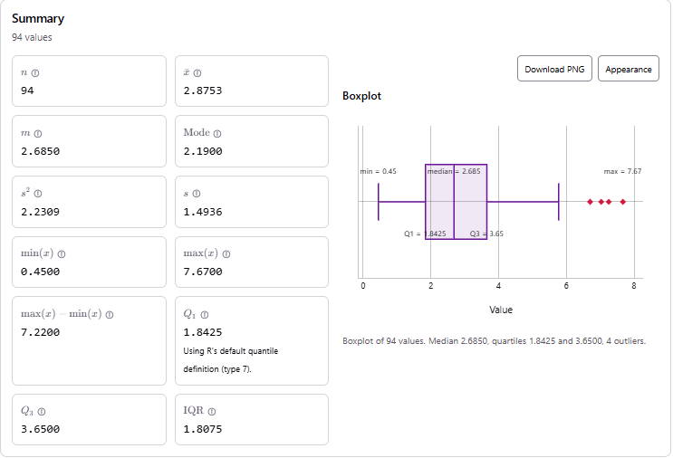
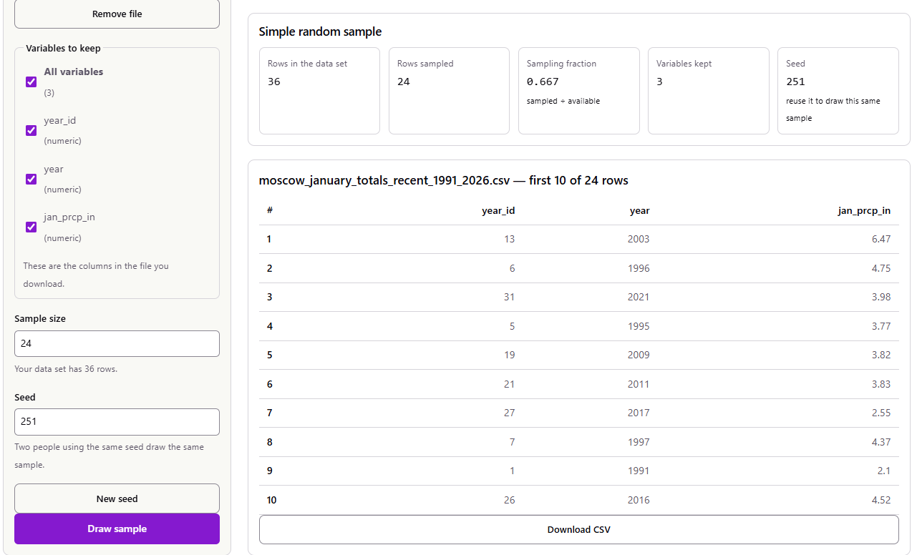
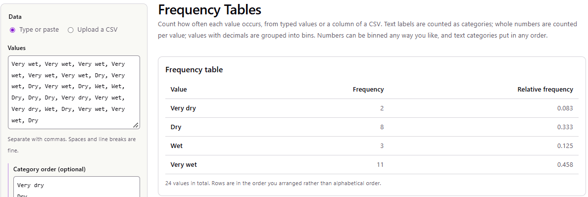
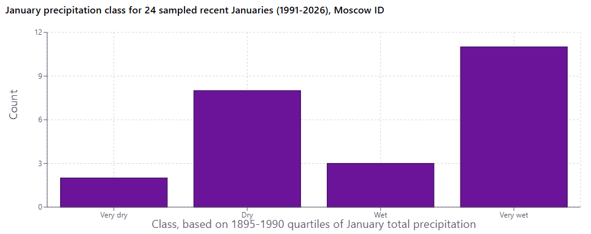
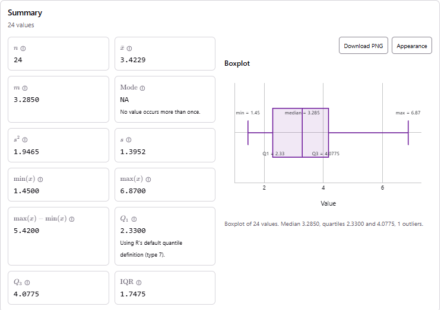
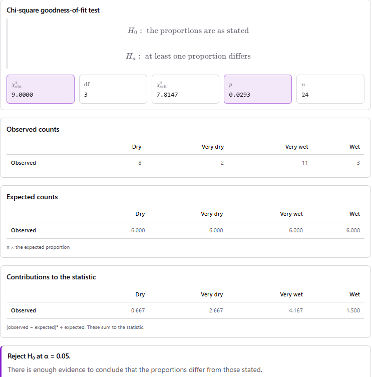

```{r setup, include=FALSE}
knitr::opts_chunk$set(echo = FALSE, message = FALSE, warning = FALSE, fig.pos = "H")
library(knitr)
library(kableExtra)

sample_jan <- read.csv("example_projects/data/january_totals_sample_seed251.csv")
all_jan    <- read.csv("example_projects/data/moscow_january_totals_1895_2026.csv")
hist_jan   <- all_jan[all_jan$era == "historical", ]

class_levels <- c("Very dry", "Dry", "Wet", "Very wet")
sample_jan$jan_class <- factor(sample_jan$jan_class, levels = class_levels)
```

::: {.callout}
<div class="callout-title">Instructor note</div>
This is a completed example of the course project. It shows what a strong report looks like when the
variable being analyzed is **categorical**. It follows the six steps on the
[Project Description](project.html) page in order, so you can compare it against the rubric section by section.
Use it to see the level of detail and explanation expected. **Do not copy its dataset, question, or wording.**
Your project should be about a topic you choose.
The example was prepared with the help of Claude (Anthropic), and every calculation in it was done with the
course's [stat-tools](https://stat-tools.jmks-homelab.dev/) site. The screenshots come from those tools.
:::

## 1. Dataset Selection

**(A) Citation.**

> Lawrimore, J. H., Ray, R., Applequist, S., Korzeniewski, B., & Menne, M. J. (2016). *Global Summary of the
> Month (GSOM), Version 1* [Data set]. Station USC00106152, MOSCOW U OF I, ID US, monthly total precipitation
> (PRCP), January 1895 – January 2026. NOAA National Centers for Environmental Information.
> <https://doi.org/10.7289/V5QV3JJ5>. Accessed September 24, 2026.

Working link to the exact data I downloaded (one row per month, standard units):
[NCEI Access Data Service query for station USC00106152](https://www.ncei.noaa.gov/access/services/data/v1?dataset=global-summary-of-the-month&stations=USC00106152&startDate=1890-01-01&endDate=2026-02-28&dataTypes=PRCP&units=standard&format=csv&includeAttributes=true&includeStationName=true).
The station's record page is
[GHCND:USC00106152](https://www.ncei.noaa.gov/cdo-web/datasets/GHCND/stations/GHCND:USC00106152/detail).

**(B) Background.** The data come from the weather station on the University of Idaho campus in Moscow. It is
a National Weather Service **Cooperative Observer (COOP)** station. A trained observer reads the rain gauge by
hand once a day, and the station's record goes back to the 1890s. The daily readings are quality-checked and
archived by NOAA's National Centers for Environmental Information (NCEI). They are part of the Global
Historical Climatology Network–Daily (GHCN-Daily) database. The *Global Summary of the Month* adds each
month's daily readings together to give a monthly total.

The original collectors did not *sample* anything: the station records every day, so the file is a complete
record of one location, not a random sample of places. The file has one row per month. I kept only the
January rows, which gives **`r nrow(all_jan)` usable Januaries**:

* `r nrow(hist_jan)` "historical" Januaries from 1895 to 1990.
* `r sum(all_jan$era == "recent")` "recent" Januaries from 1991 to 2026.
* I dropped 1894 (no value), 1927 (no record) and 1963. NOAA flags the 1963 total as including missing
  days, so it would undercount that month.

## 2. Question and Hypothesis Formulation

**(A) Question.** Moscow gets much of its yearly precipitation in winter, and January is one of its wettest
months. I want to know whether recent Januaries (1991–2026) are distributed across the dry-to-wet range the
same way the historical Januaries (1895–1990) were. For example, is a "very wet" January more common now than
it used to be?

**(B) Variables.**

* **January precipitation class** (**categorical**, ordinal). This is the variable I test. Each January is
  put in one of four classes using the *historical* quartiles of January total precipitation:
  * **Very dry:** below Q1.
  * **Dry:** between Q1 and the median.
  * **Wet:** between the median and Q3.
  * **Very wet:** above Q3.

  By construction, one quarter of historical Januaries fall in each class. So if recent Januaries behave
  like historical ones, about one quarter of them should land in each class too.
* **January total precipitation** in inches (quantitative). This is the measurement the classes are built
  from. I describe it in Part 4, but I do not test it directly.

**(C) Hypothesis in words.** Recent Januaries fall into the four historical precipitation classes in equal
proportions (25% each), the same as the historical record. The alternative is that at least one class is
more or less common now than it used to be.

### Building the classes

I entered the `r nrow(hist_jan)` historical January totals into the stat-tools **Statistic Calculator**. It
computes quartiles with R's default (type 7) definition.

```{r, fig.cap="**Figure 1.** Statistic Calculator summary and boxplot of the 94 historical January totals (inches), 1895–1990. The quartiles set the class cutoffs.", out.width="80%", fig.align="center"}

```

This gives the class cutoffs Q1 = 1.8425 in, median = 2.685 in, and Q3 = 3.65 in:

```{r}
cut_tab <- data.frame(
  Class = class_levels,
  `January total (inches)` = c("less than 1.8425", "1.8425 to 2.685", "2.685 to 3.65", "more than 3.65"),
  `Share of historical Januaries` = rep("25%", 4),
  check.names = FALSE)
kable(cut_tab, caption = "**Table 1.** Precipitation classes, defined from the 1895–1990 quartiles.") %>%
  kable_styling(full_width = FALSE, bootstrap_options = c("striped", "condensed"))
```

## 3. Sampling

**(A) and (B) Method.** My population is the **36 Januaries from 1991 to 2026**. I drew a **simple random
sample of n = 24 Januaries** without replacement, using the stat-tools **Simple Random Sample** tool.
To repeat it:

1. Save the 36 recent Januaries as a CSV with the columns `year_id` (1–36), `year` and `jan_prcp_in`.
2. Open the **Simple Random Sample** tool and upload the CSV.
3. Keep all variables, set **Sample size = 24** and **Seed = 251**, and press *Draw sample*.
   The same seed always draws the same 24 years.

```{r, fig.cap="**Figure 2.** The Simple Random Sample tool after the draw: 24 of 36 rows sampled with seed 251.", out.width="85%", fig.align="center"}

```

**(C) Justification.**

* **Why SRS.** An SRS gives every recent January the same chance of being chosen. That means no year was
  picked because I remembered it as a big snow year.
* **Why years rather than days.** I sample whole years instead of individual days, and that is deliberate.
  Rainy days come in storm systems, so neighbouring days are not independent. Two different Januaries are
  much closer to independent.
* **Why n = 24.** 24 is within the required 20–30 and divides evenly into four classes. Under $H_0$ each
  class then expects $24 \times 0.25 = 6$ Januaries, which satisfies the rule of thumb that every expected
  count be at least 5 (Part 5).
* **Why the historical Januaries are not sampled.** They are not part of the sample. They play the role of
  the *benchmark* that defines the classes, the way a published value would in a one-sample test.

**Possible bias.** The SRS itself is unbiased. However, my population is small, so 24 of 36 is a large
fraction (67%), and my conclusions only describe 1991–2026 at this one station. A bigger worry is the station
record itself. Over 130 years the gauge or its exact location may have changed. If that happened, old and new
measurements may not be perfectly comparable, and no sampling method can fix that.

**(D) The sample** is listed in full in [Appendix A](#appendix-a-the-sample).

## 4. Exploratory Statistical Description

**(A) Frequency table.** I classified each sampled January using Table 1 and counted the classes with the
stat-tools **Frequency Tables** tool:

```{r}
tab <- table(sample_jan$jan_class)
freq_tab <- data.frame(
  Class = names(tab),
  Frequency = as.integer(tab),
  `Relative frequency` = sprintf("%.3f", as.integer(tab) / sum(tab)),
  check.names = FALSE)
freq_tab <- rbind(freq_tab, data.frame(Class = "**Total**", Frequency = sum(tab),
                                       `Relative frequency` = "1.000", check.names = FALSE))
kable(freq_tab, escape = FALSE, align = c("l", "r", "r"),
      caption = "**Table 2.** Frequency table of the precipitation class for the 24 sampled Januaries.") %>%
  kable_styling(full_width = FALSE, bootstrap_options = c("striped", "condensed"))
```

```{r, fig.cap="**Figure 3.** The Frequency Tables tool's output, which matches Table 2.", out.width="85%", fig.align="center"}

```

The **modal category is "Very wet"**: 11 of the 24 Januaries (45.8%) fall in it. Under the historical pattern
only 25% of Januaries would.

**(B) Plots.**

```{r, fig.cap="**Figure 4.** Bar chart (Make Graphs tool) of the precipitation class for the 24 sampled recent Januaries. If recent Januaries followed the historical pattern, each bar would be close to 6.", out.width="85%", fig.align="center"}

```

The class comes from a quantitative measurement, so I also summarized the sampled January totals themselves
with the **Statistic Calculator**:

```{r}
x <- sample_jan$jan_prcp_in
q <- quantile(x, c(0.25, 0.5, 0.75), type = 7)
desc <- data.frame(
  Statistic = c("minimum", "Q1", "median", "mean", "Q3", "maximum", "interquartile range", "standard deviation"),
  `Sample (1991–2026), n = 24` = sprintf("%.4f", c(min(x), q[1], q[2], mean(x), q[3], max(x), q[3] - q[1], sd(x))),
  `Historical (1895–1990), N = 94` = sprintf("%.4f", c(0.45, 1.8425, 2.685, 2.8753, 3.65, 7.67, 1.8075, 1.4936)),
  check.names = FALSE)
kable(desc, align = c("l", "r", "r"),
      caption = "**Table 3.** Descriptive statistics of January total precipitation (inches) for my sample, alongside the historical reference values from Figure 1.") %>%
  kable_styling(full_width = FALSE, bootstrap_options = c("striped", "condensed"))
```

```{r, fig.cap="**Figure 5.** Statistic Calculator output and boxplot for the 24 sampled January totals (inches).", out.width="80%", fig.align="center"}

```

**(C) Shape, center and variability.**

* **Shape.** The class distribution is **not flat**. It piles up at the "Very wet" end (11) and the "Dry"
  class (8), while "Very dry" (2) and "Wet" (3) are rare.
* **Center and spread.** The underlying totals tell the same story. The sample's median January had
  3.285 in, compared with 2.685 in historically, and its mean was 3.42 in versus 2.88 in. The spread is
  similar: the sample SD is 1.40 in and the historical SD is 1.49 in, and the IQRs are 1.75 in and 1.81 in.
* **Outliers.** January 2006 (6.87 in) lies above the upper fence $Q_3 + 1.5 \cdot IQR = 4.0775 + 1.5(1.7475) = 6.70$ in.
  The tool's caption also counts it as 1 outlier, although its boxplot draws the whisker all the way to 6.87.
  An outlier cannot distort a class count the way it can distort a mean: 2006 simply counts as one "Very
  wet" January. So I kept it.

## 5. Hypothesis Testing

**(A) Hypotheses.** Let $p_{VD}, p_{D}, p_{W}, p_{VW}$ be the proportions of recent (1991–2026) Januaries in
the Very dry, Dry, Wet and Very wet classes.

\[ H_0: p_{VD} = p_{D} = p_{W} = p_{VW} = 0.25 \]
\[ H_a: \text{at least one } p_i \neq 0.25 \]

In words, $H_0$ says recent Januaries are spread across the historical classes exactly as historical
Januaries were. $H_a$ says at least one class is now more or less common. I use a significance level of
**$\alpha = 0.05$**.

**(B) Choice of test and assumptions.** I use a **$\chi^2$ goodness-of-fit test**. It compares the observed
counts of a single categorical variable with the counts a stated distribution predicts, which is exactly
my question. A one-proportion $z$ test could only look at one class at a time. The assumptions are:

1. **Random sample.** Satisfied: the Januaries were chosen by SRS (Part 3).
2. **Independent observations.** Reasonable: different Januaries are a year apart, so one January's total
   tells you little about the next one's.
3. **Large enough expected counts.** Every expected count is $n p_i = 24(0.25) = 6 \geq 5$. Satisfied.

**(C) Computations.**

*Step 1: observed and expected counts.* The expected count for each class is $E_i = n p_i = 24 \times 0.25 = 6$.

```{r}
obs <- as.integer(tab)
chi_tab <- data.frame(
  Class = class_levels,
  `Observed (O)` = obs,
  `Expected (E = 24 × 0.25)` = rep(6, 4),
  `O − E` = obs - 6,
  `(O − E)² / E` = sprintf("%.3f", (obs - 6)^2 / 6),
  check.names = FALSE)
chi_tab <- rbind(chi_tab, data.frame(Class = "**Total**", `Observed (O)` = 24,
  `Expected (E = 24 × 0.25)` = 24, `O − E` = 0,
  `(O − E)² / E` = sprintf("**%.3f**", sum((obs - 6)^2 / 6)), check.names = FALSE))
kable(chi_tab, escape = FALSE, align = c("l", "r", "r", "r", "r"),
      caption = "**Table 4.** Worked calculation of the χ² statistic.") %>%
  kable_styling(full_width = FALSE, bootstrap_options = c("striped", "condensed"))
```

*Step 2: test statistic.*

\[ X^2 = \sum_{i=1}^{4} \frac{(O_i - E_i)^2}{E_i}
      = \frac{(2-6)^2}{6} + \frac{(8-6)^2}{6} + \frac{(3-6)^2}{6} + \frac{(11-6)^2}{6}
      = \frac{16 + 4 + 9 + 25}{6} = \frac{54}{6} = 9.000 \]

*Step 3: degrees of freedom and critical value.* There are $k = 4$ classes, so $df = k - 1 = 3$. The
critical value is $\chi^2_{3,\,0.95} = 7.815$, and we reject $H_0$ if $X^2 \geq 7.815$.

*Step 4: p-value.* $p = P(\chi^2_3 \geq 9.000) = 0.0293$.

I ran the same test in the stat-tools **Categorical Tests** tool. I uploaded my sample CSV, chose the
`jan_class` column, and set the expected proportions to 0.25, 0.25, 0.25, 0.25. The tool lists the classes
alphabetically, and it reproduces every number above:

```{r, fig.cap="**Figure 6.** Categorical Tests tool output for the goodness-of-fit test: X² = 9.0000, df = 3, critical value 7.8147, p = 0.0293.", out.width="80%", fig.align="center"}

```

| Quantity | Value |
|:---|---:|
| Test statistic $X^2$ | 9.000 |
| Degrees of freedom | 3 |
| Critical value $\chi^2_{3,\,0.95}$ | 7.815 |
| $p$-value | 0.0293 |

## 6. Conclusion

**(A) Decision.** The test statistic $X^2 = 9.00$ is larger than the critical value 7.815. Equivalently,
$p = 0.029 < \alpha = 0.05$. So I **reject $H_0$**.

**(B) Interpretation.** In plain language, recent Moscow Januaries do not fall into the dry-to-wet classes the
way Januaries did from 1895 to 1990. The contributions in Table 4 show *where* the difference comes from:

* **"Very wet" contributes the most (4.17 of the 9.00).** Almost half of the sampled recent Januaries (11 of
  24) were wetter than 75% of historical Januaries, when only about 6 would be expected.
* **"Very dry" contributes the next most (2.67).** Only 2 of the 24 were drier than 75% of historical
  Januaries, instead of about 6.

In other words, the data suggest that very wet Januaries have become more common in Moscow and very dry ones
less common. The quantitative summaries agree: the sample's median January total is about 0.6 inches higher
than the historical median.

One caution: the $\chi^2$ test by itself only says the distribution *changed*. The "wetter" direction comes
from looking at the table. The test does not tell us *why* the pattern changed.

**(C) Limitations.**

* **Small sample and a fixed benchmark.** With only 24 Januaries, the result rests on a handful of years.
  Also, the cutoffs are quartiles *estimated* from 94 historical Januaries, but the test treats them as
  known exactly.
* **Scope.** The conclusion applies to this one station and to 1991–2026. It does not say how Idaho as a
  whole has changed. It also cannot say whether the change comes from climate trends, from natural swings
  (El Niño/La Niña from year to year, the Pacific Decadal Oscillation from decade to decade), or from changes
  in how the station measured precipitation.
* **Large sampling fraction.** I sampled 24 of only 36 recent Januaries. The formulas in class assume a
  very large population, so my test is, if anything, slightly conservative.
* **Class sizes.** The "Wet" class has a small observed count (3), and a couple of different sampled years
  could change the result. Drawing a second random sample, or using all 36 recent Januaries, would show
  how stable the conclusion is.

## Appendix A: the sample

```{r}
app <- sample_jan[, c("sample_order", "year_id", "year", "jan_prcp_in", "jan_class")]
names(app) <- c("Draw order", "year_id", "Year", "January total (in)", "Class")
kable(app, align = c("r", "r", "r", "r", "l"),
      caption = "**Table A1.** The 24 Januaries drawn by the Simple Random Sample tool (seed 251), in the order they were drawn.") %>%
  kable_styling(full_width = FALSE, bootstrap_options = c("striped", "condensed"))
```

<details>
<summary>**Appendix B: the 94 historical January totals used to set the class cutoffs** (click to expand)</summary>

```{r}
h <- hist_jan[order(hist_jan$year), c("year", "jan_prcp_in")]
h$cell <- sprintf("%d: %.2f", h$year, h$jan_prcp_in)
ncols <- 6
cells <- c(h$cell, rep("", ceiling(nrow(h) / ncols) * ncols - nrow(h)))
wide <- as.data.frame(matrix(cells, ncol = ncols))
names(wide) <- rep("Year: inches", ncols)
kable(wide, caption = "**Table B1.** January total precipitation (in), Moscow U of I station, 1895–1990 (1927 and 1963 not available).") %>%
  kable_styling(full_width = FALSE, bootstrap_options = c("condensed"), font_size = 13)
```

</details>

## AI Use Disclosure

::: {.callout}
<div class="callout-title">What a disclosure looks like</div>
The project requires you to disclose any AI use. This section is an **illustration of the format**. It is
here so you can see what a complete disclosure contains. Write yours about what *you* actually did.
:::

* **Service provider:** Anthropic (Claude).
* **Prompts I used:**
  1. "What are the conditions for a chi-square goodness-of-fit test, and what do I do if an expected count is
     below 5?"
  2. "Proofread this paragraph for clarity without changing the statistics: [my Part 6 paragraph]."
* **How I used it.** I used the answer to prompt 1 to check the assumptions list in Part 5(B) against my
  lecture notes, which say the same thing. I used prompt 2 to fix two awkward sentences in Part 6. I did every
  calculation myself with the stat-tools site and checked each number by hand in Part 5(C). No
  AI-generated numbers, figures or data appear in this report.
* **Citation:** Anthropic. (2026). *Claude* [Large language model]. <https://claude.ai>. Responses to prompts 1
  and 2 above, accessed September 2026.
