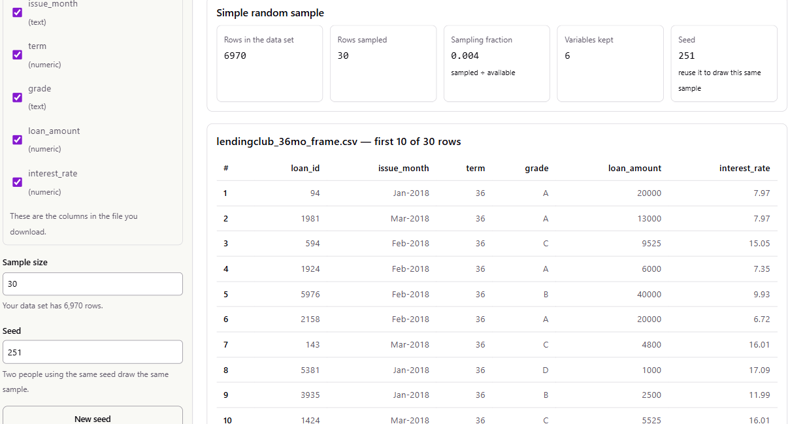
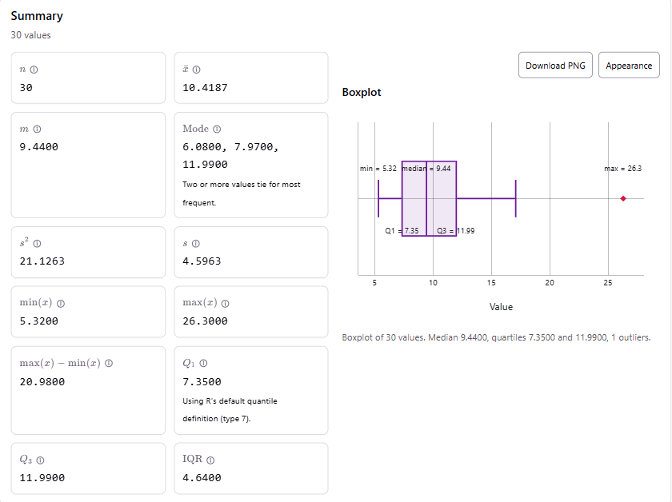
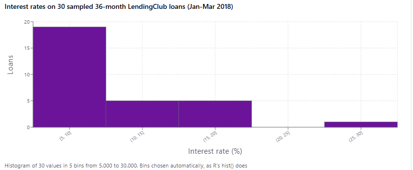
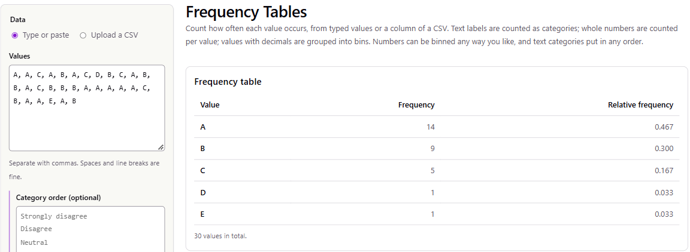
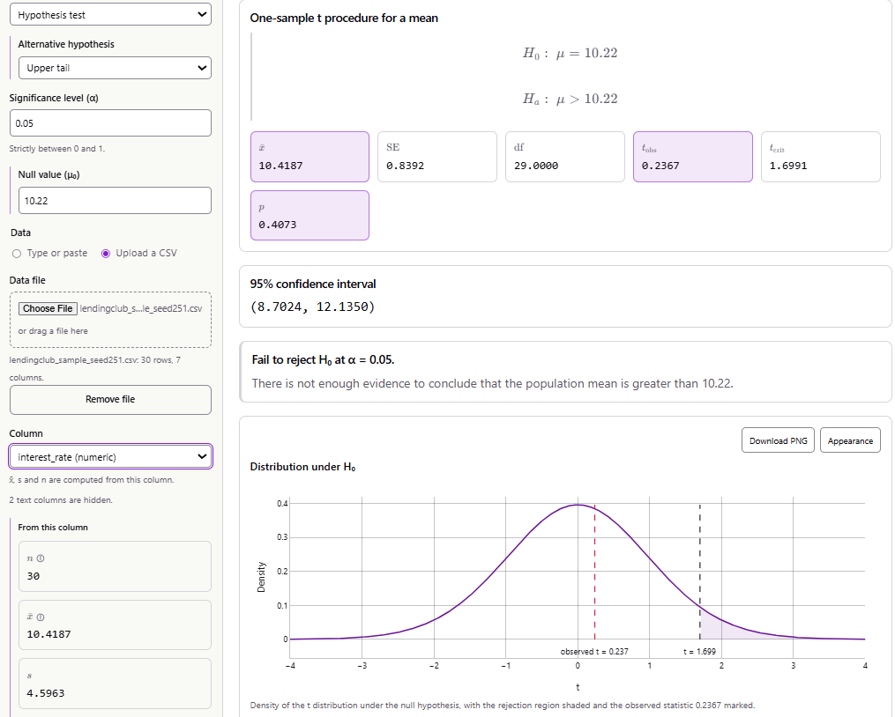

```{r setup, include=FALSE}
knitr::opts_chunk$set(echo = FALSE, message = FALSE, warning = FALSE, fig.pos = "H")
library(knitr)
library(kableExtra)

loans  <- read.csv("example_projects/data/lendingclub_loans_full_schema_kaggle.csv")
frame  <- read.csv("example_projects/data/lendingclub_36mo_frame.csv")
samp   <- read.csv("example_projects/data/lendingclub_sample_seed251.csv")
x <- samp$interest_rate
```

<!-- Print rules for the downloadable PDF (build_site.R prints this page with headless Chrome). -->
<style>
@media print {
  .pdf-download { display: none; }
  /* Bare URLs are already their own link text; don't print them twice. */
  a.uri::after { content: none !important; }
  h2, h3, h4 { break-after: avoid; page-break-after: avoid; }
  .callout, .figure, table, blockquote { break-inside: avoid; page-break-inside: avoid; }
  /* Appendices and the AI disclosure start on a fresh page rather than stranding their heading. */
  #appendix-a-the-sample, #appendix-b-the-historical-januaries, #ai-use-disclosure { break-before: page; page-break-before: always; }
  /* ...but the long appendix tables may run across pages, or their heading is left alone. */
  #appendix-a-the-sample table, #appendix-b-the-historical-januaries table { break-inside: auto; page-break-inside: auto; }
}
</style>
<div class="pdf-download">
**[Download this report as a PDF](example_project_continuous.pdf)**
</div>

::: {.callout}
<div class="callout-title">Instructor note</div>
This is a completed example of the course project. It shows what a strong report looks like when the
variable being analyzed is **quantitative**. It follows the six steps on the
[Project Description](project.html) page in order, so you can compare it against the rubric section by section.

The two example projects deliberately come from very different fields: [Example Project 1](example_project_categorical.html)
uses weather records, and this one uses consumer lending. Any topic works as long as the data can be cited
and your question fits a method from class. Use these examples to see the level of detail and explanation
expected. **Do not copy their datasets, questions, or wording.**

The example was prepared with the help of Claude (Anthropic), and every calculation in it was done with the
course's [stat-tools](https://stat-tools.jmks-homelab.dev/) site. The screenshots come from those tools.
This example also shows that a well-run test that **fails to reject** $H_0$ is still a complete, strong project.
:::

## 1. Dataset Selection

**(A) Citations.** I found the loan data on **Kaggle** and the benchmark on **FRED**. Both are data portals
listed on the course project page.

> Singh, U. (2023). *Lending Club Loan Dataset* [Data set, file `loans_full_schema.csv`]. Kaggle. License
> CC0: Public Domain. <https://www.kaggle.com/datasets/utkarshx27/lending-club-loan-dataset>. Accessed
> September 25, 2026.

> Original source of the same file: OpenIntro. *loans_full_schema: Loan data from Lending Club* [Data set].
> <https://www.openintro.org/data/index.php?data=loans_full_schema>. The data were originally published by
> LendingClub.

> Board of Governors of the Federal Reserve System (US). *Finance Rate on Personal Loans at Commercial
> Banks, 24 Month Loan* [TERMCBPER24NS]. Retrieved from FRED, Federal Reserve Bank of St. Louis,
> <https://fred.stlouisfed.org/series/TERMCBPER24NS>. Accessed September 25, 2026.

I downloaded the Kaggle file and compared it with OpenIntro's copy at
<https://www.openintro.org/data/csv/loans_full_schema.csv>. They contain the same 10,000 loans and the same
values; Kaggle adds only a row-number column.

**(B) Background.**

* **The lender.** LendingClub is a *peer-to-peer* lending platform: borrowers apply online, and the loans
  are funded by individual and institutional investors rather than by a bank's deposits.
* **The rows and variables.** Each row of the file is **one loan that was actually issued**, not an
  application. There are **`r format(nrow(loans), big.mark = ",")` loans**, all issued from January to
  March 2018, with **`r ncol(loans) - 1` variables** about the borrower and the loan. These include:
  * the borrower's income, employment and credit history
  * the loan amount, term (36 or 60 months) and purpose
  * the **interest rate**
  * a risk **grade** from A (lowest risk) to G (highest risk) that LendingClub assigned.
* **Who collected it.** LendingClub recorded these data as part of its business and published loan-level
  data for the public. OpenIntro prepared this 10,000-loan file for teaching, and a Kaggle user re-posted it.
* **How the 10,000 loans were chosen.** The documentation does not say, so I cannot claim they are a random
  sample of all LendingClub loans (see Limitations).
* **The benchmark (FRED).** The Federal Reserve reports the average rate commercial banks charge on 24-month
  personal loans in its *G.19 Consumer Credit* release. FRED lists it as a monthly series, but values are
  published only for February, May, August and November. The **February 2018** value, from the same
  quarter these loans were issued, is **10.22%**. I saved the full series as a CSV.

## 2. Question and Hypothesis Formulation

**(A) Question.** Peer-to-peer lenders advertise themselves as an alternative to banks. So did people who
took out a 3-year LendingClub loan in early 2018 pay a **higher interest rate, on average, than the 10.22%
banks were charging for personal loans** at the same time?

**(B) Variables.**

* **Interest rate** (`interest_rate`, percent per year): **quantitative, continuous**, recorded to two decimal
  places. This is the variable I test: its mean is compared with the bank benchmark.
* **Grade** (`grade`, A–G): **categorical, ordinal**. I do not test it, but I use it in Part 4 to explain the
  shape of the interest rates, because LendingClub sets the rate mainly from the grade.

**(C) Hypothesis in words.** I expect the mean interest rate on 36-month LendingClub loans to be **greater
than** 10.22%. I chose the direction before looking at any data, because the question is whether
peer-to-peer borrowers pay *more*.

## 3. Sampling

**(A) and (B) Method.**

* **Population (sampling frame).** The **`r format(nrow(frame), big.mark = ",")` loans with a 36-month term**.
  I left out the 60-month loans because their term is even further from the benchmark's 24 months.
* **Sampling method.** I drew a **simple random sample of n = 30 loans** without replacement, using the
  stat-tools **Simple Random Sample** tool.

To repeat it:

1. Open `loans_full_schema.csv` in a spreadsheet. Add a column `loan_id` numbering the rows 1–10,000, keep
   only the rows with `term` = 36, and keep only the columns `loan_id`, `issue_month`, `term`, `grade`,
   `loan_amount` and `interest_rate`. Save it as a CSV (6,970 rows).
2. Open the **Simple Random Sample** tool and upload the CSV.
3. Keep all variables, set **Sample size = 30** and **Seed = 251**, and press *Draw sample*.
   The same seed always draws the same 30 loans.

```{r, fig.cap="**Figure 1.** The Simple Random Sample tool after the draw: 30 of 6,970 loans sampled with seed 251. The first rows of the sample are shown.", out.width="90%", fig.align="center"}

```

**(C) Justification.**

* **Why SRS.** Every 36-month loan has the same chance of being chosen, so the sample is not tilted toward
  any grade, month or loan size.
* **Why not stratify.** Stratifying by grade would guarantee every grade appears. But the question is about
  the *overall* mean rate, and an SRS already represents the grades in proportion to how common they are.
* **Independence.** The loans go to different borrowers, so they are close to independent. My sample is
  only 30 of 6,970 loans (0.4%), so sampling without replacement causes no problems.

**Possible bias.**

* **The sampling itself.** The SRS introduces none.
* **The file I sampled from.** The file is a 10,000-loan subset prepared by OpenIntro, and I do not know how
  those loans were chosen. If they are not representative of all LendingClub loans from early 2018, my
  results describe this file more than LendingClub as a whole.

**(D) The sample** is listed in full in [Appendix A](#appendix-a-the-sample).

## 4. Exploratory Statistical Description

**(A) Descriptive statistics** from the stat-tools **Statistic Calculator** (R's default quartile definition):

```{r}
q <- quantile(x, c(0.25, 0.5, 0.75), type = 7)
desc <- data.frame(
  Statistic = c("minimum", "Q1", "median", "mean", "Q3", "maximum", "interquartile range", "standard deviation"),
  `Value (%)` = sprintf("%.4f", c(min(x), q[1], q[2], mean(x), q[3], max(x), q[3] - q[1], sd(x))),
  check.names = FALSE)
kable(desc, align = c("l", "r"),
      caption = "**Table 1.** Descriptive statistics of the interest rate for the 30 sampled 36-month loans.") %>%
  kable_styling(full_width = FALSE, bootstrap_options = c("striped", "condensed"))
```

```{r, fig.cap="**Figure 2.** Statistic Calculator output and boxplot for the 30 sampled interest rates (%). The red point is the high outlier (26.30%).", out.width="80%", fig.align="center"}

```

**(B) Plots.** The boxplot is in Figure 2. The histogram below came from the **Make Graphs** tool, using its
automatic bins:

```{r, fig.cap="**Figure 3.** Histogram of the interest rate on 30 sampled 36-month LendingClub loans issued January–March 2018. The bins are 5 percentage points wide.", out.width="85%", fig.align="center"}

```

To understand the shape, I also counted the sampled loans by grade with the **Frequency Tables** tool:

```{r, fig.cap="**Figure 4.** Frequency table of the LendingClub grade for the 30 sampled loans.", out.width="85%", fig.align="center"}

```

```{r}
gt <- aggregate(interest_rate ~ grade, data = samp, FUN = function(v) c(n = length(v), min = min(v), max = max(v)))
gt <- data.frame(Grade = gt$grade, Loans = gt$interest_rate[, "n"],
                 `Lowest rate (%)` = sprintf("%.2f", gt$interest_rate[, "min"]),
                 `Highest rate (%)` = sprintf("%.2f", gt$interest_rate[, "max"]), check.names = FALSE)
kable(gt, align = c("l", "r", "r", "r"),
      caption = "**Table 2.** Interest-rate range within each grade in my sample.") %>%
  kable_styling(full_width = FALSE, bootstrap_options = c("striped", "condensed"))
```

**(C) Shape, center and variability.**

* **Shape.** The distribution is **clearly right-skewed**. Most loans (19 of 30) carry rates between 5% and
  10%, and a few riskier loans stretch the tail out to 26%. The mean (10.42%) is about one percentage point
  above the median (9.44%), which fits the skew.
* **Why it is skewed.** Table 2 shows where the skew comes from. LendingClub sets rates by grade, and 23 of
  my 30 loans are grade A or B, the low-risk, low-rate grades. The few C, D and E loans are the ones that
  stretch the right tail.
* **Center.** The median rate is **9.44%** and the mean is **10.42%**. The benchmark (10.22%) falls between
  them.
* **Variability.** The standard deviation is **4.60 percentage points** and the IQR is **4.64 points**, so
  the middle half of the loans had rates from 7.35% to 11.99%.
* **Outliers.** The upper fence is $Q_3 + 1.5 \cdot IQR = 11.99 + 1.5(4.64) = 18.95\%$. The single
  grade-E loan at **26.30%** lies above it, so it is an outlier. It is a real loan, not an error: grade-E
  rates in the full file run in the mid-20s. I kept it.
  * The outlier pulls the mean *up*, which works in favour of my alternative hypothesis.
  * I check its influence in Part 5.

## 5. Hypothesis Testing

**(A) Hypotheses.** Let $\mu$ be the mean interest rate of 36-month LendingClub loans issued January–March
2018.

\[ H_0: \mu = 10.22\% \qquad\qquad H_a: \mu > 10.22\% \]

In words:

* $H_0$: peer-to-peer borrowers paid the same average rate as the bank benchmark.
* $H_a$: they paid more on average.

I use a significance level of **$\alpha = 0.05$**.

**(B) Choice of test and assumptions.** I use a **one-sample $t$ test for a mean**. I have one
quantitative variable and want to compare its mean with a fixed benchmark. The population standard
deviation is unknown, so the test uses $s$ and the $t$ distribution.

The assumptions are:

1. **Random sample.** Satisfied, because the loans were chosen by SRS (Part 3).
2. **Independent observations.** Satisfied: the loans go to different borrowers, and the sample is a
   tiny fraction of the frame.
3. **Approximately normal population, or a large enough sample.** This is the assumption to watch. The
   rates are right-skewed, with one outlier. With $n = 30$, the Central Limit Theorem makes the sampling
   distribution of $\bar{x}$ approximately normal for moderate skew like this, so the $t$ test is
   reasonable. I also rerun it without the outlier below.

**(C) Computations.**

*Step 1: observed statistics* (Table 1): $n = 30$, $\bar{x} = 10.4187\%$, $s = 4.5963\%$.

*Step 2: standard error.*
\[ SE = \frac{s}{\sqrt{n}} = \frac{4.5963}{\sqrt{30}} = \frac{4.5963}{5.4772} = 0.8392 \]

*Step 3: test statistic.*
\[ t_{obs} = \frac{\bar{x} - \mu_0}{s/\sqrt{n}} = \frac{10.4187 - 10.22}{0.8392} = \frac{0.1987}{0.8392} = 0.237 \]

*Step 4: degrees of freedom and critical value.* $df = n - 1 = 29$. For an upper-tail test at
$\alpha = 0.05$ the critical value is $t_{29,\,0.95} = 1.699$, and we reject $H_0$ only if $t_{obs} \geq 1.699$.

*Step 5: p-value.* $p = P(t_{29} \geq 0.237) = 0.407$.

*Step 6: 95% confidence interval for $\mu$* ($t_{29,\,0.975} = 2.045$):
\[ \bar{x} \pm t_{29,\,0.975}\, SE = 10.4187 \pm 2.045(0.8392) = 10.4187 \pm 1.716 = (8.70\%,\ 12.14\%) \]

I ran the test in the stat-tools **One Sample Tests** tool with these settings:

* Mean, hypothesis test, upper tail, $\alpha = 0.05$, $\mu_0 = 10.22$.
* Data: the sample CSV uploaded, with the `interest_rate` column chosen.

It reproduces every value above:

```{r, fig.cap="**Figure 5.** One Sample Tests tool output: SE = 0.8392, df = 29, t = 0.2367, critical value 1.6991, p = 0.4073, and 95% CI (8.7024, 12.1350). The observed t falls far short of the shaded rejection region.", out.width="85%", fig.align="center"}

```

| Quantity | Value |
|:---|---:|
| Sample mean $\bar{x}$ | 10.42% |
| Standard error | 0.839 |
| Degrees of freedom | 29 |
| Test statistic $t_{obs}$ | 0.237 |
| Critical value $t_{29,\,0.95}$ | 1.699 |
| $p$-value | 0.407 |
| 95% CI for $\mu$ | (8.70%, 12.14%) |

*Effect of the outlier.* I removed the 26.30% loan and reran the same $t$ test in R with `t.test()`. That gives
$n = 29$, $\bar{x} = 9.87\%$, $s = 3.54\%$ and $t = -0.53$. The conclusion does not change, and without the
outlier the sample mean even falls *below* the benchmark.

## 6. Conclusion

**(A) Decision.** The test statistic $t_{obs} = 0.24$ is well below the critical value 1.699, and
$p = 0.41 > \alpha = 0.05$. So I **fail to reject $H_0$**.

**(B) Interpretation.** My sample does **not** give convincing evidence that 3-year LendingClub borrowers in
early 2018 paid more, on average, than the 10.22% banks were charging for personal loans.

* **Rates vary a lot.** The sample's average (10.42%) was only 0.2 points above the benchmark. Rates vary so
  much from loan to loan (SD about 4.6 points) that a difference that small could easily come from chance
  alone.
* **Plausible values.** The 95% confidence interval says the true average rate is plausibly anywhere from
  about **8.7% to 12.1%**. That range includes 10.22%.
* **This does not prove the rates are equal.** "Fail to reject" means my data could not tell the two
  apart, not that they are the same.
* **The size of difference I could detect.** To reject $H_0$, my sample mean would have had to be at least
  $10.22 + 1.699(0.8392) \approx 11.65\%$. So with 30 loans this study could only have picked up a
  difference of roughly 1.4 percentage points or more. A real but smaller difference could easily go
  undetected.

**(C) Limitations.**

* **The benchmark is not a perfect match.**
  * The bank rate is for **24-month** loans, and mine are 36-month loans.
  * More importantly, banks and LendingClub serve **different borrowers**. Banks turn away many riskier
    applicants, while LendingClub lends across grades A–G. So even if a difference were found, it would not
    show that LendingClub charges *the same borrower* more. The two groups of borrowers differ, which is a
    classic confounding problem.
* **Skew and small sample.** The right skew and the outlier make $n = 30$ adequate but not generous for a
  $t$ test. A small sample also gives the test little power to detect modest differences (see above).
* **The data file.** The 10,000 loans are a subset whose selection method is not documented. They cover only
  three months, and only loans that were actually issued. Applicants who were rejected, or who turned down a
  high-rate offer, are not in the data.

::: {.callout}
<div class="callout-title">Instructor note: what the full dataset shows</div>
Because you have the whole data file, you can check a sample's conclusion against it, which is rarely
possible in real research. The mean rate over **all 6,970** 36-month loans in the file is **11.24%**,
about one point *above* the benchmark. So in this file $H_0$ is actually false, and this sample's test
missed it. That is a **Type II error**.

It was not bad luck so much as low power. With a true difference of about 1 point and an SD of about 4.4
points, a sample of 30 has only about a **34%** chance of rejecting $H_0$. About 117 loans would be needed
for an 80% chance. The student's conclusion is still correct as written: they said the evidence was not
convincing, not that the rates were equal. That is exactly the right way to report a non-significant result.
:::

## Appendix A: the sample

```{r}
app <- samp[, c("sample_order", "loan_id", "issue_month", "grade", "loan_amount", "interest_rate")]
app$loan_id <- as.character(app$loan_id)  # an ID, so no thousands separator
names(app) <- c("Draw order", "loan_id", "Issued", "Grade", "Loan amount ($)", "Interest rate (%)")
kable(app, align = c("r", "r", "l", "l", "r", "r"), format.args = list(big.mark = ","),
      caption = "**Table A1.** The 30 loans drawn by the Simple Random Sample tool (seed 251), in the order they were drawn. All are 36-month loans. Only the interest rate is analyzed.") %>%
  kable_styling(full_width = FALSE, bootstrap_options = c("striped", "condensed"))
```

## AI Use Disclosure

::: {.callout}
<div class="callout-title">What a disclosure looks like</div>
The project requires you to disclose any AI use. This section is an **illustration of the format**. It is
here so you can see what a complete disclosure contains. Write yours about what *you* actually did.
:::

* **Service provider:** Anthropic (Claude).
* **Prompts I used:**
  1. "Where can I find the average interest rate banks charge on personal loans, month by month?"
  2. "My t test failed to reject. How do I explain that in plain language without saying the two means are
     equal?"
* **How I used it.**
  * Prompt 1 pointed me to FRED. I found the series, checked it on the Federal Reserve's page, and chose the
    February 2018 value myself.
  * Prompt 2 helped me word Part 6(B). I rewrote its suggestion in my own words and checked it against my
    lecture notes on significance tests.
  * All calculations were done with the stat-tools site and my own hand calculations in Part 5(C). The one
    exception is the outlier check, which I ran in R with `t.test()`. No AI-generated numbers, figures or data
    appear in this report.
* **Citation:** Anthropic. (2026). *Claude* [Large language model]. <https://claude.ai>. Responses to prompts 1
  and 2 above, accessed September 2026.
