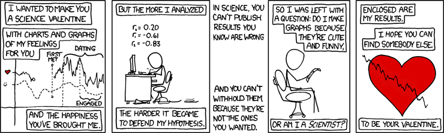

```{r setup, include=FALSE}
knitr::opts_chunk$set(echo = TRUE)
```

<!-- The hero below carries the title, instructor and term, so rmarkdown's
     default #header block would just repeat it. Hiding it page-locally keeps
     the change here instead of adding a body class for one page.

     NOTE: the `author:` map form (author: / name: / email:) used to live in the
     YAML above. Pandoc renders it as invalid HTML - a nested anchor inside an
     anchor, plus an unbalanced closing address tag - so it was removed rather
     than restyled. The instructor line in the hero replaces it. -->
<style>#header { display: none; }</style>

<div class="hero">
<p class="eyebrow">Spring 2024</p>
<h1 class="hero-title">STAT 251-03</h1>
<p class="hero-subtitle">Statistical Methods</p>
<p class="hero-meta">University of Idaho &middot; Instructor: Jarred Kvamme &middot; <a href="mailto:jarredk@uidaho.edu">jarredk@uidaho.edu</a></p>
</div>

<div class="card-grid">

<a class="card" href="syllabus.html">
<h2 class="card-title">Syllabus</h2>
<p class="card-text">Grading, policies, required materials and how the course runs.</p>
<span class="card-more">Read &rarr;</span>
</a>

<a class="card" href="Course_Schedule.html">
<h2 class="card-title">Course Schedule</h2>
<p class="card-text">Week-by-week topics, reading, and exam dates.</p>
<span class="card-more">Browse &rarr;</span>
</a>

<a class="card" href="lecturemenu1.html">
<h2 class="card-title">Lecture Notes</h2>
<p class="card-text">Worked notes for all sixteen weeks, with R code and figures.</p>
<span class="card-more">Weeks 1&ndash;16 &rarr;</span>
</a>

<a class="card" href="homeworks/homework_downloads.html">
<h2 class="card-title">Homework</h2>
<p class="card-text">All five assignments as printable PDFs, plus every data file they use.</p>
<span class="card-more">Downloads &rarr;</span>
</a>

<a class="card" href="study_guides/exam1_study_guide.html">
<h2 class="card-title">Exam Study Guides</h2>
<p class="card-text">Study guides and review problems for each exam and the final.</p>
<span class="card-more">Prepare &rarr;</span>
</a>

<a class="card" href="https://stat-tools.jmks-homelab.dev/">
<h2 class="card-title">Tools &amp; Calculators</h2>
<p class="card-text">Interactive calculators for probabilities, tests, and plots.</p>
<span class="card-more">Open &rarr;</span>
</a>

</div>

<div class="band">
<h2 class="band-title">Welcome</h2>

This site contains all the material for Jarred Kvamme's Statistical Methods
course (STAT 251-03) at the University of Idaho for the spring semester of 2024.

Everything is reachable from the menu above: lecture notes are organized by
week, homework assignments and their solutions live under **Homeworks**, and
**Resources** collects the statistical tables, R code examples, and setup
instructions you will need through the term.
</div>

<div class="comic-break">
<p class="eyebrow">Comic break</p>

<div class="comic-grid">

<figure>

<figcaption><a href="https://xkcd.com/1772">xkcd 1772</a></figcaption>
</figure>

<figure>

<figcaption><a href="https://xkcd.com/701">xkcd 701</a></figcaption>
</figure>

</div>
</div>
