```{r setup, include=FALSE}
knitr::opts_chunk$set(echo = TRUE)
library(knitr)
library(kableExtra)
library(ggplot2)
library(ggthemes)
library(ggpubr)
library(latex2exp)
```

<!--
  SCOPE OF THIS PAGE.

  Week 4 is Monday Sept 14 (Lecture 8: sampling designs), Wednesday Sept 16
  (Exam 1 review) and Friday Sept 18 (Exam 1). On Sept 14 Lecture 8 got as far
  as systematic sampling, skipping slide 17. The Lecture 8 deck was trimmed to
  slides 1-20 (through "Drawing an SRS in practice"). Everything after that moved
  into Lecture 9 on Monday Sept 21 (Week 5): a review, the skipped slide 17, two
  "in the news" sampling-design slides (the AP-NORC poll and the UK Biobank
  light-at-night study), then systematic sampling onward. Lecture 9 in turn only
  reached its slide 14 ("Three common nonsampling errors"), so the nonsampling
  examples, the sampling-design practice, the project Part 3 slide and all of
  Experiments and Causation moved again, into Lecture 10 on Wednesday Sept 23.
  The material is still written up here as one piece:
    lecture_slides/Week 4/Week4_Lecture8_Slides_9_14_2026.pptx    slides 1-20
    lecture_slides/Week 5/Week5_Lecture9_Slides_9_21_2026.pptx    slides 1-14
    lecture_slides/Week 5/Week5_Lecture10_Slides_9_23_2026.pptx   the rest

  Examples are deliberately from this century, and every figure quoted was
  checked against the sources listed at the bottom of the page. Figures come
  from assets/make_lecture8_figures.R, which asserts every number quoted about
  them.

  Sections that used to live elsewhere:

    * the 2024 "Study Design", "Causation vs Association", "Experimental
      Design" and "Surveys" sections (Week 5 notes) and "Sources of Bias In
      Surveys", "More Complicated Sampling Designs" and "Ethical studies"
      (Week 6 notes) are REPLACED by this page - several of their claims were
      wrong, so they were rewritten rather than moved. Do not re-add them.
    * "The normal distribution and z-scores" (the cereal sodium example)
                                                      -> Week 5, Wednesday Sept 23
    * "Percentiles and the Cumulative Distribution"  -> Week 3, Friday Sept 11
    * "Variance and standard deviation"               -> Week 3, Wednesday Sept 9
-->

Last week we wrapped up **descriptive statistics**. We can now describe the shape, center, and
spread of a distribution, as well as the position of any individual value within it. All of that
material is fair game for Exam 1.

This week we take a step back and ask a question that really should come first: how were the data
collected in the first place? How a set of data is collected determines what we are allowed to
conclude from it. In particular, there are two questions we want to be able to answer about any
study:

* **Can we generalize the results from the sample to the whole population?** This depends on the
  **sampling design**, which is the topic of the first half of this lecture.
* **Can we conclude that one variable causes a change in another?** This depends on the
  **experimental design**, which we will cover in the second half.

# Sampling designs

## Starting with a question

Suppose we wanted to know how many hours a week a typical University of Idaho student spends
exercising. We obviously can't ask every student, so how would we go about getting the data? Who
would we ask, and how would we choose them?

* Take a minute and think about how you would do it. We will come back to your answer throughout
  this section.

## Some terminology

Before we go any further, let's start with some terminology:

* The **population** is the entire group of individuals we want to learn about. In our example,
  the population is every UI student.
* A **parameter** is a number that describes the population, such as the population mean $\mu$ or
  the population proportion $p$. Here, the parameter is the mean weekly exercise hours of <i>all</i>
  UI students.
* The **sample** is the part of the population that we actually observe, i.e., the students we end
  up asking.
* A **statistic** is a number computed from the sample, such as $\bar{x}$ or $\hat{p}$. Here, that
  would be the mean hours for the students we asked.
* A **census** collects data on every member of the population. A census is usually slow and
  expensive, and often impossible.
* The **sampling frame** is the list of units we actually draw the sample from, for example the
  registrar's list of enrolled students. The sampling frame is rarely a perfect copy of the
  population.
* The **sampling design** is the method we use to choose the sample from the sampling frame.
* A **representative sample** is a sample that has the same characteristics as the population it
  came from. Getting a representative sample is the goal of every sampling design.
* **Sampling error** is the difference between a statistic and the parameter it estimates that
  comes purely from which units happened to be chosen. If we took a different sample, we would get
  a slightly different answer.

### Example: census, frame and sampling error

```{r, include=FALSE}
fx <- read.csv('assets/l8_frame_example.csv')
```

Consider a small school with 100 students, and suppose we ask them "how many hours did you
exercise last week?" If we ask all 100 students, that is a **census**, and their mean of
`r sprintf("%.1f", fx$mu)` hours is the **parameter**. Now suppose the registrar's list, which is
our **sampling frame**, only has 90 students on it. The 10 students who enrolled late (shown in
grey) have no chance of being chosen. A simple random sample of 10 students from the list (shown in
red) has a mean of `r sprintf("%.1f", fx$xbar)` hours, which is our **statistic**. The **sampling
error** is then `r sprintf("%.1f", fx$xbar)` - `r sprintf("%.1f", fx$mu)` =
`r sprintf("%.1f", fx$error)` hours. If we took another random sample, we would get a different
sampling error.

```{r, echo=FALSE, out.width='55%', fig.align='center'}
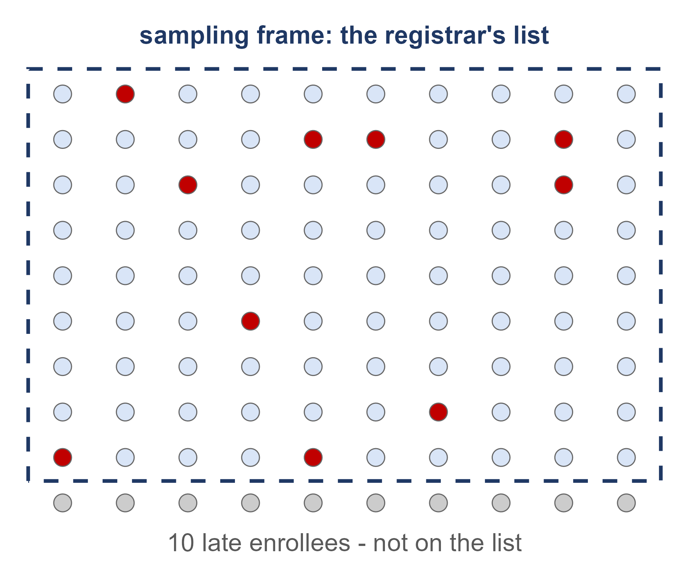
```

### Practice: find the sampling frame

**Practice:** For each of the following, what is the sampling frame? Does it match the population
well?

1. Student government wants to know how students feel about raising the parking fee. They email a
   survey to 500 students picked at random from the university email directory.
   *Frame: the email directory. It lists nearly every enrolled student, so it matches the
   population pretty well.*
2. A Moscow coffee shop wants its customers' opinions on a new menu. It surveys 100 people picked
   at random from its loyalty-app members.
   *Frame: the loyalty-app member list. Customers who never signed up for the app can't be
   chosen.*
3. A city council wants residents' views on a new bike lane. It calls numbers picked at random from
   a printed phone directory.
   *Frame: the phone directory. It misses everyone without a listed landline, and those people
   tend to be younger.*

## Thinking critically about studies

Whenever we read about a study, there are some questions we should ask ourselves before we trust
the results. Section 1.2 of the textbook gives a nice list of things to look out for (the
*Critical Evaluation* list):

* **Problems with samples** - is the sample representative of the population? A biased sample will
  give results that are inaccurate and not valid.
* **Self-selected samples** - responses only from people who chose to respond, like call-in or
  online polls, are often unreliable.
* **Sample size** - samples that are too small may be unreliable. Larger samples are better when
  possible, but sometimes a small sample can't be avoided (e.g., crash tests or rare conditions).
* **Undue influence** - were the data collected, or the questions asked, in a way that pushes
  people toward a certain answer?
* **Nonresponse** - if a lot of people refused to participate, the responses we did get may not
  represent the population. People with strong opinions tend to be the most likely to respond.
* **Causality** - just because two variables are related does not mean one causes the other.
* **Self-funded or self-interest studies** - a study paid for by someone who wants a particular
  answer should be read carefully. That said, we should judge a study on its merits and not just on
  who paid for it.
* **Misleading use of data** - watch out for poorly displayed graphs, incomplete data, or numbers
  reported without any context.
* **Confounding** - when the effects of several factors on the response can't be separated, it is
  hard (or impossible) to draw conclusions about any one of them.

We will spend most of this lecture on these issues. We start with bias and self-selected samples,
then nonresponse and question wording, and finally causality and confounding in the second half.

### Examples: misleading graphs

**OxyContin.** Purdue promoted OxyContin, a 12-hour opioid painkiller, using a chart of blood
levels over time with the caption "Fewer 'peaks and valleys' than with immediate-release
oxycodone." The catch is that the chart was drawn on a logarithmic y-axis
([CBS News, 2011](https://www.cbsnews.com/news/how-purdue-used-misleading-charts-to-hide-oxycontins-addictive-power/)).
On a log axis, equal distances represent equal <i>ratios</i> rather than equal differences, so a
steep drop can look pretty gentle. The figure below is only an illustration and is not Purdue's
actual data. It shows a single curve matched to the values in the 2008 FDA label for a 10 mg dose
(a peak of 10.6 ng/mL at about 2.7 hours and a half-life of 4.5 hours), drawn on both types of axis.

```{r, include=FALSE}
ox <- read.csv('assets/l8_oxy_example.csv')
```

```{r, echo=FALSE, out.width='55%', fig.align='center'}
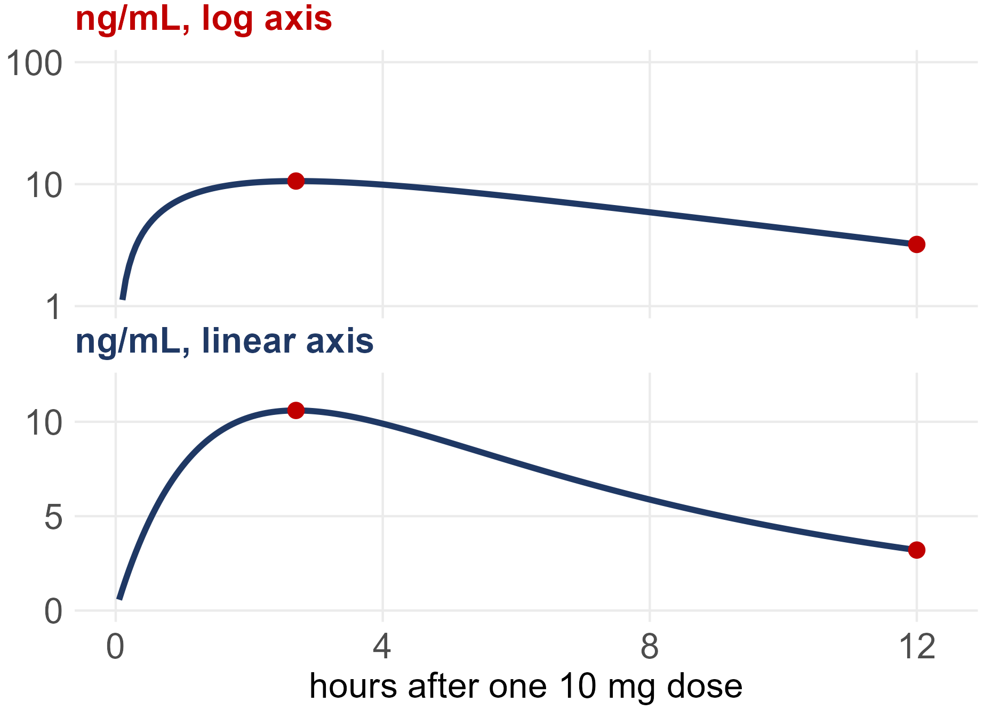
```

On the linear axis, the blood level drops from 10.6 to `r sprintf("%.1f", ox$c12)` ng/mL over the
12 hours, which is a drop of about `r ox$drop`%. In 2007, The Purdue Frederick Company pleaded
guilty to misbranding OxyContin "with the intent to defraud and mislead." The government's
statement of facts says sales staff used "graphs that exaggerated the differences between blood
plasma levels" of OxyContin and other pain medications, and the company paid about $600 million
([U.S. Attorney, Western District of Virginia, 2007](https://web.archive.org/web/2017/https://media.defense.gov/2007/May/10/2001711223/-1/-1/1/purduefrederick1.pdf)).
To be clear, there is nothing wrong with a log axis by itself, and scientists use them all the
time. The problem is using one to back up a claim that the reader has no way to check.

**ExxonMobil.** We should read a company's own report just as carefully as anyone else's,
especially when the company has a financial stake in the answer. ExxonMobil's *2024 Advancing
Climate Solutions* report shows its plan for cutting its *emissions intensity* (emissions per unit
produced) as a bar chart with no numbers on the y-axis. Its abatement curve has no axis numbers
either. So a reader can't tell how big the planned cut actually is, or how much of it depends on
"CCS, hydrogen, and/or future advancements"
([Union of Concerned Scientists, 2024](https://blog.ucs.org/carly-phillips/greenwashing-in-graphs-an-exxonmobil-story/)).

Keep in mind that intensity can go down while total emissions go up, if the company produces more.
In this case, the report's own table shows both going down from 2016 to 2023. Intensity fell from
26.4 to 23.3 tonnes per 100 tonnes of throughput or production, and emissions from its operations
(Scope 1 and 2) fell from 117 to 98 million tonnes. What neither number includes is the emissions
from burning the oil and gas the company produces. That was about 540 million tonnes in 2023,
roughly 85% of its footprint, and the company sets no target for it
([ExxonMobil, 2024](https://corporate.exxonmobil.com/-/media/global/files/advancing-climate-solutions/2024/2024-advancing-climate-solutions-report.pdf)).

## Convenience and voluntary response samples

There are two ways of getting a sample that are tempting because they are quick, cheap, and easy:

* A **convenience sample** is made up of whoever is easiest to reach. For example, we could stand
  outside the Student Recreation Center and ask the first 50 people who walk by.
* A **voluntary response sample** is one where we put out a call and let people decide whether or
  not to respond. For example, we could post a poll on a UI student Instagram account and count the
  replies. The textbook calls these <i>self-selected samples</i>.

* What could go wrong with each of these?

Consider the Rec Center survey first. Its average will be **too high**, since the people at the
Rec Center are the ones who exercise, and students who never go there have no chance of being
chosen. The Instagram poll only hears from followers who happen to see the post <i>and</i> decide
to reply, which will often be the proudest gym-goers or people who feel strongly one way or the
other. Also notice that asking 2,000 people instead of 50 does not fix either problem. More of the
same kind of people just gives us the same wrong answer with more confidence.

What these two designs have in common is that **a person decides who ends up in the sample**.
Either the researcher picks whoever is handy, or the respondents pick themselves. A design like
this is called **biased**, meaning it systematically favors certain outcomes over others.

### Practice: convenience or voluntary response?

**Practice:** For each scenario below, identify the type of sample and what could go wrong.

1. A nutrition club wants to know how many servings of vegetables UI students eat a day. Members
   ask the first 60 students who walk out of the campus dining hall at lunch.
   *Convenience sample. Only students who eat lunch at the dining hall can be chosen, so
   off-campus students and students who cook for themselves are left out.*
2. The campus paper wants to know whether students favor moving 8 a.m. classes later. It posts a
   "Vote now!" link on social media; 1,200 students vote and 85% say yes.
   *Voluntary response sample. Students who dread 8 a.m. classes are the most eager to vote, so 85%
   probably overstates support. Having 1,200 votes doesn't fix that.*
3. A professor wants to know how many hours a week the 300 students in her lecture study. She asks
   the 25 students who come to her office hours that week.
   *Convenience sample, since it's just whoever showed up. Students who come to office hours
   probably study more than the class as a whole, so the estimate is likely too high.*

### Example: the Twitter poll

On December 18, 2022, Elon Musk posted a poll on Twitter asking *"Should I step down as head of
Twitter? I will abide by the results of this poll."* In 12 hours the poll got more than 17.5
million votes, and 57.5% of them said yes
([NBC News](https://www.nbcnews.com/tech/social-media/twitter-users-vote-elon-musk-quit-ceo-poll-rcna62332);
[Associated Press](https://www.pbs.org/newshour/nation/twitter-poll-closes-majority-of-users-vote-for-musk-to-step-down-as-ceo)).
But the only people who could vote were those who saw the post and chose to vote, which was mostly
Musk's own followers, and there was nothing stopping fake accounts from voting. This is a voluntary
response sample. The 17.5 million votes only tell us about the people who chose to vote, and the
huge sample size doesn't change that.

### Example: online opt-in polls

Many online polls use what are called <i>opt-in panels</i>. Anyone can sign up to take surveys, and
they get paid for each survey they complete. In opt-in samples, 12% of adults under 30 (and 24% of
Hispanic respondents) said they were licensed to operate a nuclear submarine. In December 2023, an
opt-in poll found that 20% of adults under 30 agreed that "the Holocaust is a myth." When Pew
Research Center asked the same question to a probability-based (i.e., random) sample, the figure
was 3%
([Mercer, Kennedy and Keeter, 2024](https://www.pewresearch.org/short-reads/2024/03/05/online-opt-in-polls-can-produce-misleading-results-especially-for-young-people-and-hispanic-adults/)).
Most of this difference came from bogus and careless respondents who were answering for the money
rather than giving their real opinions. So when you see a shocking number about some subgroup, keep
in mind that it may say more about who signed up for the poll than about what people actually
think.

## Bias vs. standard error

A helpful way to think about bias is to picture a target. The parameter is the bullseye, and each
estimate is one shot at the target. Every time we take a sample and compute the statistic, we take
a shot and see where it lands. If we take a new sample, we take a new shot. There are two different
things that can go wrong:

```{r, echo=FALSE, out.width='55%', fig.align='center'}
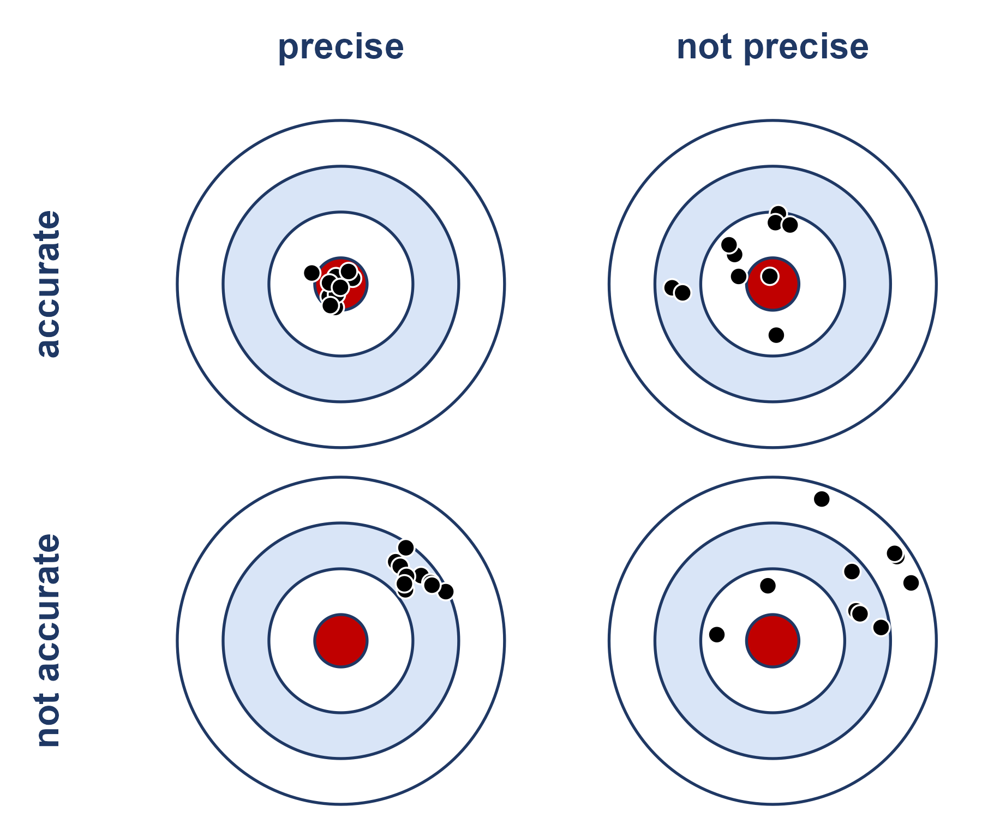
```

* **Bias** is a problem with <i>accuracy</i>. The shots are centered away from the bullseye and
  miss in the same direction every time. Bias comes from the design (i.e., who gets into the
  sample), and it does not average out.
* **Standard error** is a problem with <i>precision</i>. It measures how spread out the shots are
  from one sample to the next. Recall from the Week 3 notes that $SE(\bar{x}) = s/\sqrt{n}$, which
  gets smaller as the sample size gets bigger.

Convenience and voluntary response samples are biased. No matter how carefully we carry them out,
they are aimed at the wrong spot.

### A bigger sample does not fix bias

To see this, consider the simulation below. Suppose that 40% of UI students exercise at least three
times a week. One survey asks $n = 2000$ people at the Student Recreation Center, where 75% of the
people exercise that often. The other survey is a simple random sample of only $n = 200$ students.
We repeat each survey 5000 times.

```{r, echo=FALSE, out.width='75%', fig.align='center'}
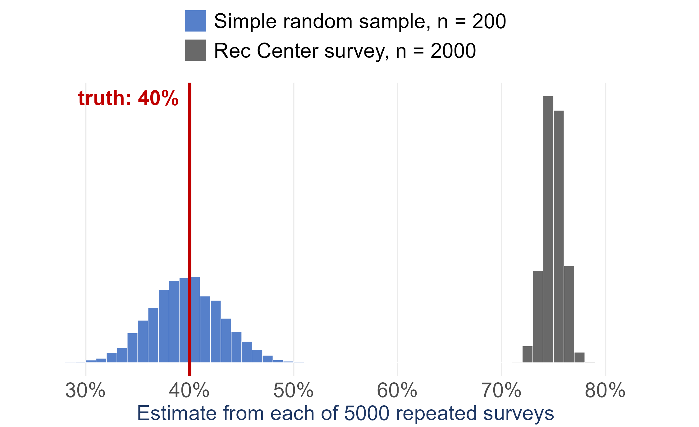
```

Notice that the Rec Center survey is much more <i>precise</i>, since its estimates barely change
from one repeat to the next. But every single one of its 5000 estimates misses the true value by
about 35 percentage points. Simply put, collecting more data gets us more precision, but only a
better design gets us accuracy.

## Random sampling

Convenience and voluntary response samples go wrong because a person gets to decide who is in the
sample, so the solution is to take the person out of the decision. **Random sampling** uses chance
to choose the sample, so neither the researcher nor the respondents decide who gets in. Since
nobody is doing the choosing, the selection process can't systematically favor anyone. Of course,
chance will still cause our estimate to change from sample to sample. However, it changes according
to rules we understand, which means we can measure how much it changes. This is exactly what the
standard error does.

## Simple random sampling

A **simple random sample (SRS)** of size $n$ is chosen so that <u>every possible group of $n$ units
has the same chance of being the sample</u>. As a result, every unit in a population of size $N$
has the same chance, $n/N$, of being included in the sample.

All of the grid pictures in these notes use the same population: $N = 100$ students on a
$10 \times 10$ grid, where each row is a class year (40 first-years, 30 sophomores, 20 juniors, and
10 seniors). Every design draws a sample of $n = 20$ students, so each student in the SRS below had
a $20/100$, or 1 in 5, chance of being selected.

```{r, echo=FALSE, out.width='45%', fig.align='center'}
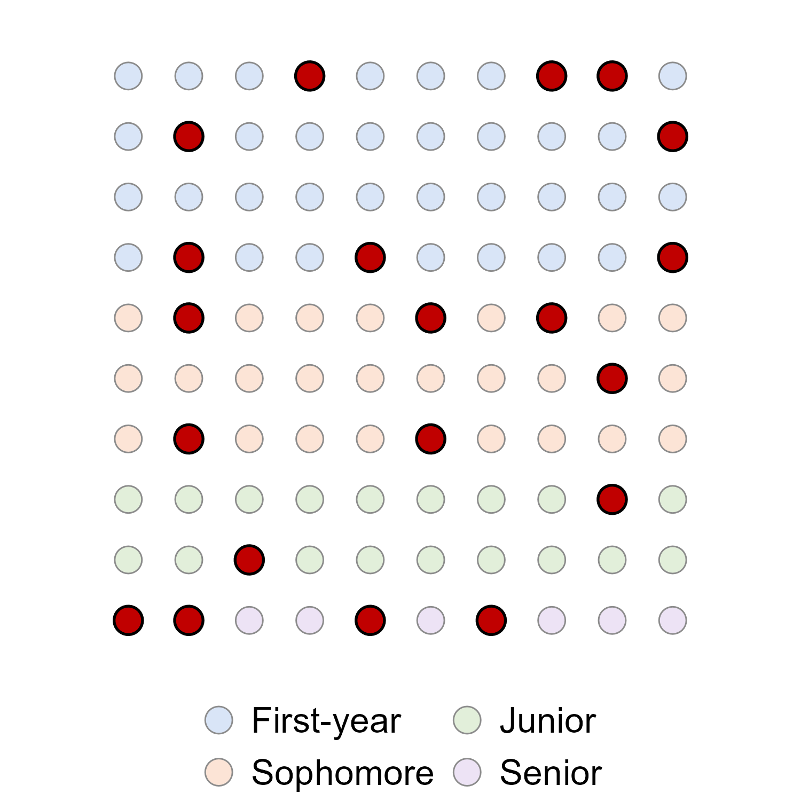
```

Take a look at the class years of the students in red. This SRS happened to pick 4 seniors but only
2 juniors, even though there are twice as many juniors as seniors. This isn't a problem with the
method. An SRS is fair <i>on average</i> across all of the samples it could have produced, but that
doesn't mean every individual sample will be balanced.

### How to draw an SRS

In practice, drawing an SRS comes down to three steps:

1. Get a sampling frame and number its units from $1$ to $N$.
2. Use a random number generator to choose $n$ different numbers.
3. The units with those numbers make up the sample.

In R, the `sample()` function takes care of step 2. For example, using the `heights.csv` data from
the course Data page ($N = 379$):

```{r}
heights <- read.csv('Data/heights.csv')
set.seed(251)                              # makes the draw repeatable
srs_rows <- sample(1:nrow(heights), 30)    # 30 of the 379 row numbers
head(heights[srs_rows, ])
```

By default, `sample()` draws **without replacement**, meaning once a unit has been picked it can't
be picked again. This is the usual choice for surveys. When we sample **with replacement**, every
unit is put back after it is drawn, so the same unit could show up in the sample more than once
(`sample(..., replace = TRUE)`). When $N$ is much larger than $n$, the two methods are practically
the same, because the chance of drawing the same unit twice is very small.

```{r, echo=FALSE, out.width='100%', fig.align='center'}
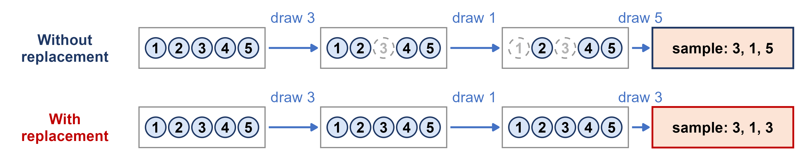
```

In the figure above, when we sample without replacement each ball that is drawn is removed from the
bag, so the sample 3, 1, 5 can't have any repeats. When we sample with replacement, every ball goes
back in the bag before the next draw, so 3 can be drawn twice.

### Examples: two recent sampling designs

**A national poll.** In *State of the Facts 2026*, the AP-NORC Center for Public Affairs Research
and USAFacts asked U.S. adults how much they trust government information and AI. The poll
interviewed 1,036 adults from July 29 to August 10, 2026: 1,017 online and 19 by phone, in English
or Spanish. The margin of sampling error is $\pm 4.1$ percentage points
([AP-NORC and USAFacts, 2026](https://apnorc.org/projects/state-of-the-facts-2026/)). The
respondents came from AmeriSpeak, NORC's <i>probability-based</i> panel. NORC randomly selects U.S.
addresses and then recruits those households by mail, by phone and in person. Nobody can sign
themselves up, so chance decides who is invited
([NORC, About AmeriSpeak](https://www.norc.org/services-solutions/amerispeak/about.html)). That is
the opposite of the opt-in panels above. Random selection doesn't solve everything, though. Only
10.3% of the invited panel members completed this survey (AAPOR response rate 3), so nonresponse
is still a concern. We come back to it under nonsampling error below. The methodology is on page 42
of the [full report](https://apnorc.org/wp-content/uploads/2026/09/State_of_the_facts_2026.pdf).

**A longitudinal study.** The UK Biobank is a cohort of about 500,000 UK adults aged 40–69 who
agreed to join between 2006 and 2010. Researchers have followed them through their health records
ever since. From 2013 to 2015, 103,615 of them wore a wrist sensor with a light meter for 7 days.
A 2026 study then removed people with unreliable sensor data, 2,770 night-shift workers, anyone
who already had heart disease, and anyone without a later heart MRI. That left 11,071 people, who
had an MRI of their heart a median of 3.1 years after wearing the sensor. Hospital and death
records were followed for 8 to 10 years
([Dai et al., 2026](https://doi.org/10.1093/eurheartj/ehag563);
[ESC, 2026](https://www.escardio.org/news/press/press-releases/too-much-light-at-night-changes-the-shape-and-working-of-the-heart/)).
Because the same people are measured at more than one point in time, this is a **longitudinal**
study: night light was measured first and the heart later. It is not a random sample of any
population, however. The authors point out that the UK Biobank cohort is mostly White and
healthier than the general population, so the results may not generalize to everyone. We return to
this study under association vs. causation.

## Systematic sampling

A **systematic sample** selects every $k^{th}$ unit from an ordered list, starting at a
<i>randomly chosen</i> point among the first $k$ units. With $N = 100$ and $n = 20$, we have
$k = N/n = 5$. In the figure below, the 100 students are numbered in list order. The random
starting point was 2, so the sample is made up of positions 2, 7, 12, 17, ..., 97.

```{r, echo=FALSE, out.width='100%', fig.align='center'}
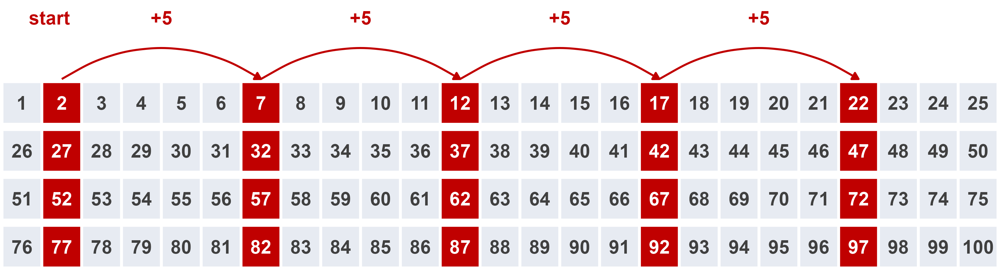
```

Systematic sampling is easy to carry out in the field, where there often isn't a list at all until
the units show up. As long as the order of the list has nothing to do with what we are measuring, a
systematic sample behaves like an SRS. The danger is when the list has a repeating pattern that
lines up with $k$. For example, on our seating grid with rows of 10, counting every 5th seat would
select the <i>same two columns</i> every time.

For a project dataset with $N = 379$ rows and $n = 30$, we have $379/30 = 12.6$, so we would take
$k = 12$ and pick a random starting point between 1 and 12:

```{r}
set.seed(251)
k <- 12
start <- sample(1:k, 1)
sys_rows <- seq(start, by = k, length.out = 30)
sys_rows
```

## Stratified random sampling

**Strata** are groups of units that are similar in some way, and they are formed <i>before</i> we
take the sample. Examples include class year, region, age group, or sex. A **stratified random
sample** takes a separate SRS within each stratum and then combines them.

Under **proportional allocation**, each stratum gets its share of the total sample size $n$. Our
population is 40% first-years, 30% sophomores, 20% juniors, and 10% seniors, so a sample of 20
students would take 8, 6, 4, and 2 students from each class year, respectively.

```{r, echo=FALSE, out.width='45%', fig.align='center'}
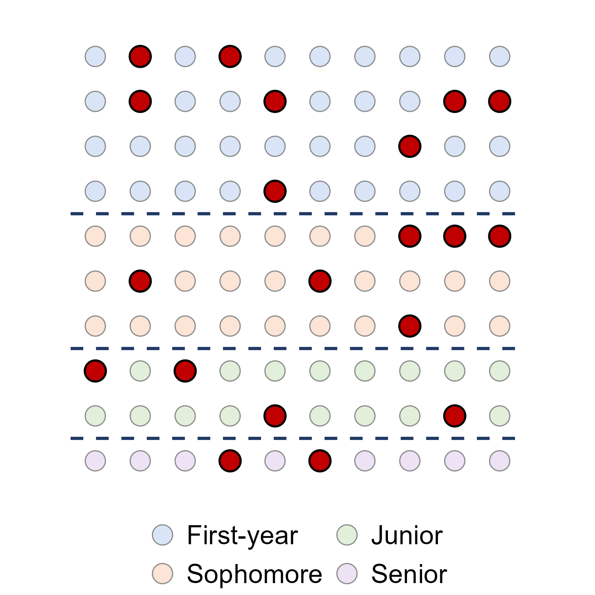
```

Stratifying guarantees that every group is represented in the sample, so we can't end up with only
2 juniors by bad luck. It also gives more precise estimates than an SRS of the same size, <u>as long
as units are similar within strata and different between strata</u>. This is because the variation
from stratum to stratum is removed from the sampling error. If the strata are no more alike inside
than the population as a whole, stratifying doesn't buy us anything.

### Example: proportional allocation with the heights data

```{r, include=FALSE}
n_f <- sum(heights$GENDER == 'Female')
n_m <- sum(heights$GENDER == 'Male')
alloc_f <- round(30 * n_f / nrow(heights))
alloc_m <- round(30 * n_m / nrow(heights))
stopifnot(nrow(heights) == 379, n_f == 262, n_m == 117,
          alloc_f == 21, alloc_m == 9, alloc_f + alloc_m == 30)
```

The `heights.csv` data has $N = `r nrow(heights)`$ people: `r n_f` female and `r n_m` male. For a
stratified sample of $n = 30$ we would take

$$\text{female: } 30 \times \frac{262}{379} = `r round(30 * n_f / 379, 2)` \approx `r alloc_f`, \qquad
\text{male: } 30 \times \frac{117}{379} = `r round(30 * n_m / 379, 2)` \approx `r alloc_m`$$

```{r, echo=FALSE, out.width='80%', fig.align='center'}
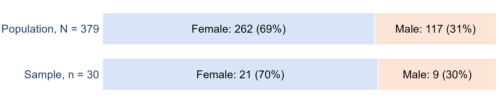
```

We would then draw an SRS of `r alloc_f` of the women and a separate SRS of `r alloc_m` of the men:

```{r}
set.seed(251)
women <- which(heights$GENDER == 'Female')
men   <- which(heights$GENDER == 'Male')
strat_rows <- c(sample(women, 21), sample(men, 9))
table(heights$GENDER[strat_rows])
```

Large national surveys use stratification. For example, the Current Population Survey, which is
used to produce the U.S. unemployment rate, groups areas into strata that are "as homogeneous as
possible with respect to labor force and other social and economic characteristics" and then
samples within each stratum
([Census Bureau and BLS, Technical Paper 77](https://www2.census.gov/programs-surveys/cps/methodology/CPS-Tech-Paper-77.pdf)).

## Cluster sampling

A **cluster** is a group of units that occurs naturally, such as a dorm, a classroom, a city block,
or a village. A **cluster sample** takes an SRS of clusters and then measures <i>every</i> unit in
the clusters that were chosen. In the figure below, each column is a cluster, and two columns were
chosen at random.

```{r, echo=FALSE, out.width='45%', fig.align='center'}
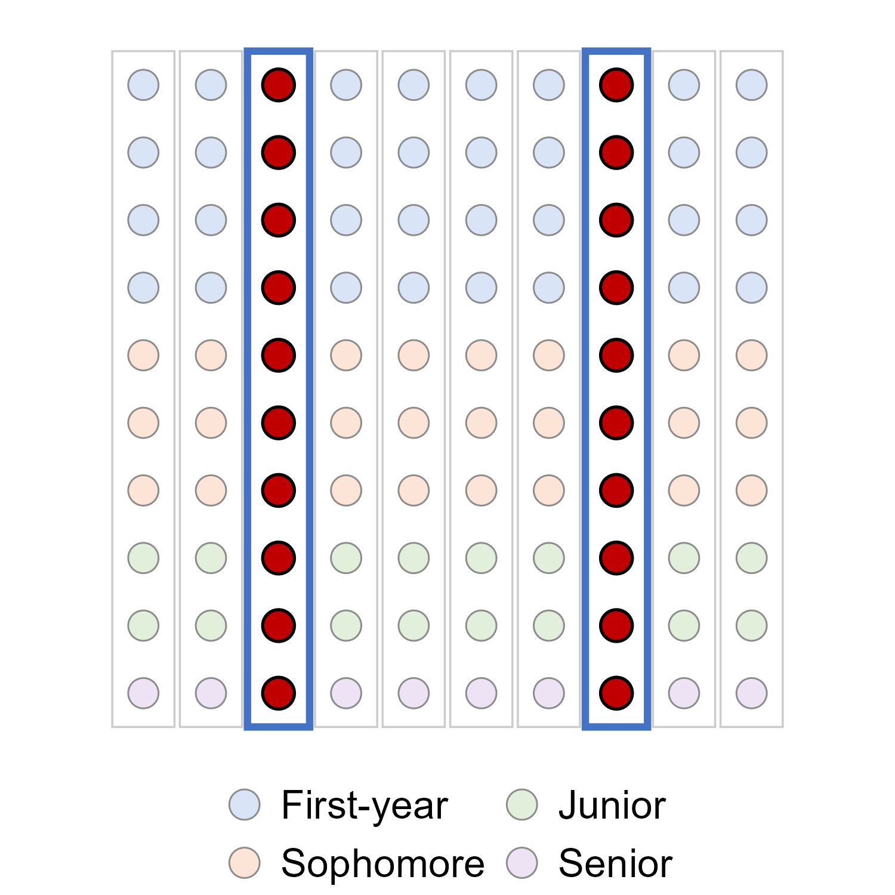
```

The main appeal of cluster sampling is practical. We only need a list of the clusters rather than a
list of every individual, and visiting a few clusters is much cheaper than traveling to units spread
out across a whole region. Cluster sampling works best when each cluster is like a
<i>mini-population</i>, meaning it is mixed inside, the same way every column above contains all
four class years. When units in the same cluster tend to be similar to each other (e.g., students in
the same dorm or households on the same street), a cluster sample carries less information than an
SRS of the same size, and its estimates are less precise.

### Two-stage cluster sampling

A **two-stage cluster sample** first takes an SRS of clusters (stage 1) and then takes an SRS of
units within each chosen cluster (stage 2). In the figure below, 4 of the 10 columns were chosen,
and then 5 students were chosen from each of those columns.

```{r, echo=FALSE, out.width='45%', fig.align='center'}
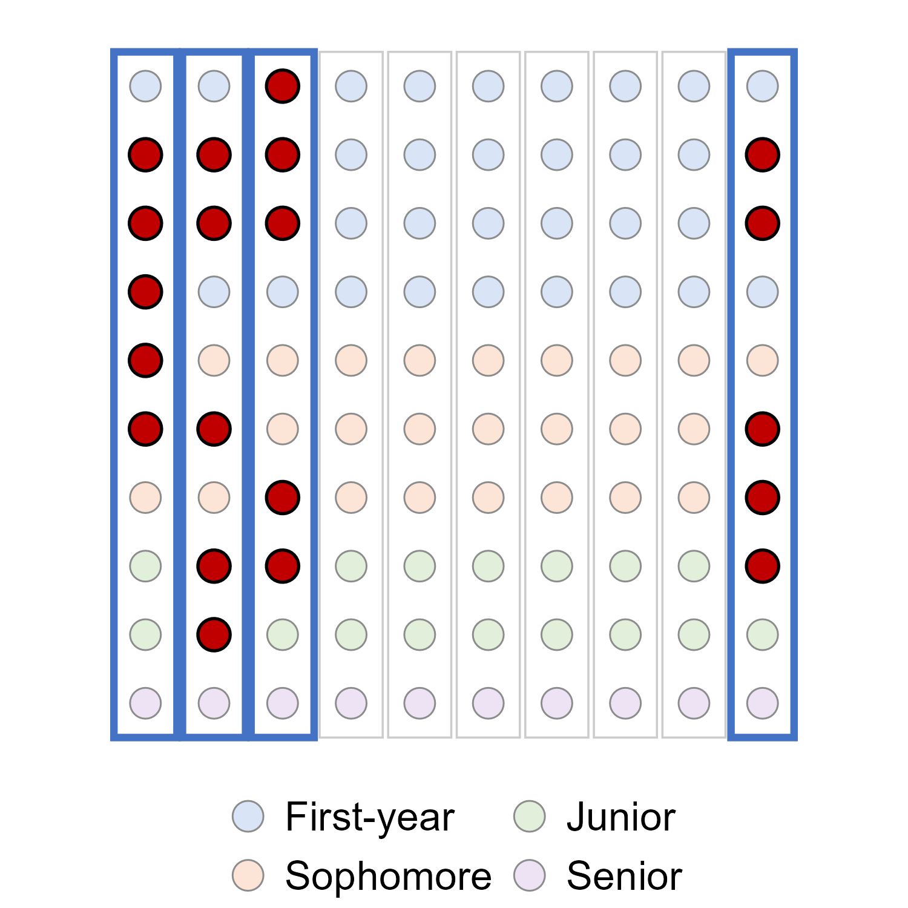
```

Election exit polls are a good example of combining several of these designs. For the 2024
election, the National Election Pool drew a stratified probability sample of 279 polling places.
Within each polling place, an interviewer approached every $n^{th}$ voter leaving, which is a
systematic sample within each cluster
([National Election Pool methods statement, 2024](https://s.abcnews.com/assets/dtci/elections/NEPExitPollMethodologyStatement.pdf)).
Similarly, NHANES, the U.S. health and nutrition survey, uses "a complex, multistage, probability
sampling design," which samples counties, then segments within counties, then households, and
finally individuals
([CDC, NHANES sample design](https://wwwn.cdc.gov/nchs/nhanes/tutorials/sampledesign.aspx)).

## Strata vs. clusters

Strata and clusters are easy to mix up, since both involve dividing the population into groups. The
difference is in what the groups look like inside, and as a result, how many of the groups we
sample:

```{r, echo=FALSE, out.width='100%', fig.align='center'}
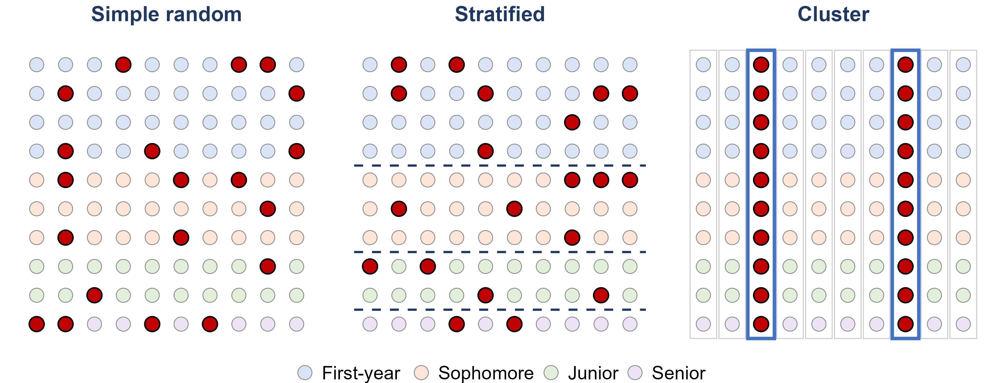
```

| | **Strata** | **Clusters** |
|:--|:--|:--|
| Units inside a group are... | alike | mixed (a mini-population) |
| Groups differ from each other? | yes | ideally not |
| Which groups are sampled? | **every** stratum | **some** clusters |
| Within a chosen group... | an SRS | every unit (or an SRS, in two stages) |
| Main benefit | precision, and every group represented | cost and convenience |

## Sampling and nonsampling error

No sample will match its population exactly. It helps to separate the reasons why into two types of
error:

* **Sampling error** is the natural difference between a sample and the population that comes from
  which units happened to be chosen. Every sample has some sampling error, and a larger sample makes
  it smaller.
* **Nonsampling error** is error that does not come from chance. This includes biased sampling
  methods, poorly worded questions, data entry mistakes, or a faulty measuring instrument. A larger
  sample does not make nonsampling error any smaller.
* **Sampling bias** occurs when some members of the population are less likely to be chosen than
  others, for example in convenience and voluntary response samples, or when the sampling frame
  leaves people out.

## Common sources of nonsampling error

Even if we use a perfectly random design, we can still end up with a biased sample. Three common
culprits are:

* **Undercoverage** - the sampling frame leaves out part of the population. For example, students
  who aren't on the list you sampled from, or people who don't have a phone or a fixed address.
* **Nonresponse** - people who are selected for the sample can't be reached or refuse to answer.
* **Response bias** - the answers themselves are wrong. This can be caused by leading or confusing
  questions, sensitive topics, or respondents wanting to please the interviewer.

Just like before, a larger sample doesn't fix any of these.

### Example: nonresponse

Pew Research Center's telephone surveys reached 36% of the people they called in 1997, but only 6%
in 2018
([Kennedy and Hartig, 2019](https://www.pewresearch.org/short-reads/2019/02/27/response-rates-in-telephone-surveys-have-resumed-their-decline/)).
A low response rate by itself doesn't make a survey biased. It only causes bias when the people who
respond are different from the people who don't. Unfortunately, this is usually impossible to check,
because we have no data on the people who didn't respond.

Nonresponse also came up after the 2020 presidential election. National polls in the final two
weeks overstated Joe Biden's margin by 3.9 points on average, which was the largest polling error
for the national popular vote in 40 years. The American Association for Public Opinion Research's
task force ruled out several explanations, like late-deciding voters, and concluded that "at least
some of the polling error in 2020 was caused by unit nonresponse." However, without knowing how the
people who didn't respond compare with the people who did, they could not pin down the primary
source of the error
([AAPOR Task Force on 2020 Pre-Election Polling](https://aapor.org/wp-content/uploads/2022/11/Task-Force-on-2020-Pre-Election-Polling_Executive-Summary.pdf)).

### Example: question wording

In September 2013, CNBC asked half of the people in its poll about "Obamacare" and the other half
about "the Affordable Care Act." These are the same law! Opposition was 46% when it was called
"Obamacare" and 37% when it was called "the Affordable Care Act." Interestingly, support was
<i>also</i> higher for "Obamacare" (29% vs. 22%). This is because far fewer people chose "don't
know" for "Obamacare" (12%) than for the Affordable Care Act (30%)
([NBC News, 2013](https://www.nbcnews.com/news/amp/wbna53122899);
[Harvard Political Review](https://harvardpolitics.com/aca-vs-obamacare-american-people/)).
So the words we use in a question can change the answers we get.

The wording of a question can also change what the question is actually measuring. In January 2003,
68% of Americans favored "taking military action in Iraq to end Saddam Hussein's rule." But when the
question added "even if it meant that U.S. forces might suffer thousands of casualties," support
dropped to 43%
([Pew Research Center, Writing Survey Questions](https://www.pewresearch.org/our-methods/u-s-surveys/writing-survey-questions/)).

## Sampling for your course project

Part 3 of the [course project](project.html) asks you to draw a sample of 20 to 30 observations from
your dataset. When you write this part up, you should:

* choose a sampling design (simple random, systematic, stratified, or cluster sampling)
* explain exactly how you drew the sample (the method, $n$, and the tool you used, such as the R
  code above) so that someone else could repeat it
* justify why you chose that design for <i>your</i> data. Is there a natural group worth
  stratifying on? Are there natural clusters?
* describe any bias your method might introduce

You can start on Steps 1 through 4 of the project once we finish this lecture.

If you want some practice before starting the project, try the textbook's **Sampling Experiment**
lab (Section 1.6). It lists restaurants by city and by entree cost, and asks you to draw a simple
random sample, a systematic sample, two stratified samples, and a cluster sample from the same
list. The examples in Section 1.2 (Examples 1.11 to 1.13) are also good practice for identifying
sampling designs.

# Experiments and causation

## Observational studies and experiments

Most studies are interested in the relationship between two or more variables. Again, let's start
with some terminology:

* The **response variable** is the outcome we measure.
* The **explanatory variable** is the variable we think explains or influences the response.
* An **observational study** observes individuals and measures variables of interest <u>without
  trying to influence anything</u>.
* An **experiment** <u>deliberately assigns</u> treatments to the units and then measures the
  response.

The key question for telling these apart is: **who decided which group each unit ended up in?** If
the units themselves (or circumstance) decided, then it is an observational study. If the
researcher decided, it is an experiment. Note that this has nothing to do with how the units were
<i>sampled</i>. An experiment on volunteers is still an experiment, and an observational study on a
random sample is still an observational study.

## Association vs. causation

* A **statistical association** between two variables is a numerical measure of their relatedness.
* A **causal relationship** between two variables means that changing one variable causes a
  proportional change in the other. This is also called a cause-and-effect relationship.
* A **lurking variable** is a variable unknown to the researchers and not included in the study,
  which is associated with <u>both</u> the explanatory and the response variable.
* Two variables are **confounded** when their effects on the response cannot be separated, so
  neither effect can be credited to one variable alone.

```{r, echo=FALSE, out.width='65%', fig.align='center'}
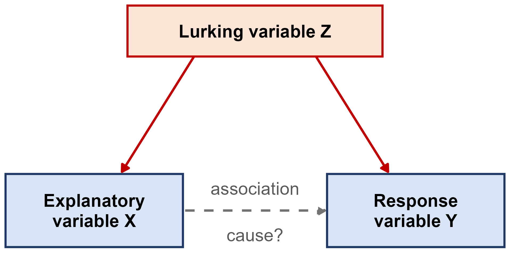
```

For example, towns that sell more ice cream also have more drownings. This association is real (it
shows up in the data every year), but the causal story is wrong. Hot weather is a lurking variable
that drives both. It is important to note that a lurking variable doesn't create a fake
association. The association is real, it just has the wrong explanation. An observational study by
itself can't rule this out, because the groups being compared may differ in ways that nobody
measured.

### Example: hormone therapy

For many years, large observational studies found that women who took hormone therapy after
menopause had much less heart disease. In the Nurses' Health Study, which followed 59,337 women,
current users of estrogen plus progestin had a relative risk of major coronary heart disease of
0.39 compared to non-users ([Grodstein et al., 1996](https://europepmc.org/article/MED/8672166)).
Millions of women were prescribed hormones, partly to protect their hearts.

Then the Women's Health Initiative <i>randomly assigned</i> 16,608 women aged 50 to 79 to take
either estrogen plus progestin or a placebo. In 2002, after an average of 5.2 years, the trial was
stopped early because the risks outweighed the benefits. Invasive breast cancer had crossed its
stopping boundary, and the hormone group actually had <i>more</i> coronary heart disease, not less
(hazard ratio 1.29)
([Writing Group for the WHI Investigators, 2002](https://doi.org/10.1001/jama.288.3.321)).

So why did the observational studies point in the wrong direction? It turns out that women who
chose to take hormone therapy tended to be wealthier, better educated, and healthier to begin with.
When the observational studies were pooled and adjusted for socioeconomic status, the apparent
benefit went away ([Humphrey, Chan and Sox, 2002](https://europepmc.org/article/MED/12186518)). In
the randomized trial, random assignment balanced these lurking variables between the two groups
automatically.

It is worth being precise about what that trial did and did not test, because the result was
reported far more broadly than it was designed to support. The WHI estrogen-plus-progestin trial
was a **primary prevention** trial: it enrolled postmenopausal women aged 50 to 79 with an intact
uterus, whose average age was about 63, more than a decade past the typical age of menopause. Every
woman in the treatment group received the same fixed daily dose of one oral formulation, 0.625 mg
of conjugated equine estrogens plus 2.5 mg of medroxyprogesterone acetate in a single tablet. Its
primary outcome was coronary heart disease, with invasive breast cancer as the primary adverse
outcome. It was not asking whether hormone therapy relieves menopausal symptoms, it did not test
transdermal patches or doses tailored to the patient, and it did not enroll perimenopausal women at
all. Its conclusion was about *that* regimen, started *that* late, used for *chronic disease
prevention*.

The labeling has since caught up with those distinctions. In November 2025 the FDA asked
manufacturers to revise the labels of menopausal hormone therapy products, noting that the average
WHI participant was 63 and that the formulation tested is "no longer in common use"
([FDA, 2025](https://www.fda.gov/drugs/drug-alerts-and-statements/fda-requests-labeling-changes-related-safety-information-clarify-benefitrisk-considerations)).
On February 12, 2026 the FDA approved the first batch of those changes, removing the statements
about cardiovascular disease, breast cancer, and probable dementia from the **boxed warning** of
six products
([FDA, 2026](https://www.fda.gov/news-events/press-announcements/fda-approves-labeling-changes-menopausal-hormone-therapy-products)).
The boxed warning about endometrial cancer remains for estrogen-alone products, and information
about cardiovascular and breast cancer risk remains elsewhere in the labeling; what changed is how
prominently and how broadly the risks are stated. The FDA's labeled recommendation is now to begin
systemic therapy within 10 years of menopause, generally before age 60, with dose, route, and
duration individualized.

Current reviews make the same point: timing, formulation, and route of administration all matter,
and transdermal estradiol appears to have a safer cardiovascular profile than the older oral
preparations ([Blackburn and Kunadian, 2026](https://doi.org/10.1093/ehjopen/oeag054)). A 2025
analysis of more than 3,800 postmenopausal women, presented at The Menopause Society annual
meeting, found less anxiety and depression with transdermal than with oral therapy and no
difference in cardiovascular disease, concluding that the route "should be individualized"
([The Menopause Society, 2025](https://menopause.org/press-releases/oral-or-transdermal-hormone-therapy-the-mental-health-risks-are-not-the-same)).
That one is a conference presentation rather than a peer-reviewed paper, so treat it as
preliminary.

For our purposes, the interesting part is that the lurking-variable problem from 1996 has not gone
away. Observational studies again report lower cardiovascular risk among women who start therapy
early: in a 2026 cohort of 83,670 matched pairs, women who began within a year of menopause had a
cardiovascular disease hazard ratio of $0.70$, about 30% lower than matched non-users
([Lu et al., 2026](https://doi.org/10.1093/hropen/hoag072)). But the 2025 Cochrane review of the
*randomized* trials still finds little to no difference in coronary events for women starting
within 10 years of menopause (relative risk $0.94$, 95% CI $0.78$ to $1.13$), with increased stroke
and venous thromboembolism
([Bofill Rodriguez et al., 2025](https://doi.org/10.1002/14651858.CD004143.pub6)).

* Two study designs, two answers. Which one can tell us whether starting therapy early *prevents*
  heart disease?

The randomized one. Women who choose hormone therapy are still healthier than women who do not, so
the observational gap may once again be partly selection rather than effect. This is not a reason
to dismiss the newer evidence, and it is not the 2002 story repeating itself: the case for early,
individualized therapy in women with symptoms rests on strong evidence for **symptom relief**, on
the mismatch between WHI's population and the women actually being treated, and on the timing
evidence. It does not yet rest on a demonstrated randomized cardiovascular benefit. Keeping those
two claims separate is exactly the skill this section is about.

### Example: coffee and the risk of death

A lurking variable can even make an association point the wrong way. The NIH-AARP Diet and Health
Study followed 402,260 adults (229,119 men and 173,141 women) aged 50 to 71 from 1995 to 2008, and
asked them at the start how much coffee they drank. When the researchers adjusted only for age,
men who drank 6 or more cups a day had a 60% higher risk of death than men who drank no coffee
(hazard ratio 1.60). However, coffee drinkers were also much more likely to smoke: 34.7% of the
men who drank 6 or more cups a day were current smokers, compared with 4.8% of the men who drank
none. After adjusting for smoking and other potential confounders, the same comparison showed a
10% <i>lower</i> risk of death (hazard ratio 0.90), with fewer deaths from heart disease among
coffee drinkers as well ([Freedman et al., 2012](https://doi.org/10.1056/NEJMoa1112010)).

* What is the lurking variable, and why did the association flip?

Smoking. Heavy coffee drinkers smoked far more, and smoking, not coffee, is what raised their risk
of death. Once smoking was accounted for, the harmful-looking "coffee effect" disappeared. Keep in
mind that this is still an observational study. The authors state that they cannot tell whether
the lower risk after adjustment is caused by coffee or is just an association.

Two decades of better-adjusted research have kept pointing the same way. A 2026 analysis of 354,957
UK Biobank participants, followed for a median of 13 years, found that people drinking 5 or more
cups a day had a lower risk of cirrhosis (hazard ratio $0.68$, 95% CI $0.58$ to $0.79$), liver
cancer ($0.53$, $0.34$ to $0.83$), and death from liver disease ($0.58$, $0.45$ to $0.74$) than
non-drinkers, with less liver fat on MRI in the subgroup that was scanned
([Kim et al., 2026](https://doi.org/10.1016/j.cgh.2026.04.035)). Notice the cohort: this is the
same UK Biobank used in the light-at-night study, so the same caveat applies. The authors say
plainly that "residual confounding and reverse causation cannot be excluded" and that their
participants were mostly of European ancestry and relatively health-conscious.

For the heart specifically, the American Heart Association reviewed this literature in a 2026
scientific statement and reported that caffeine, "studied primarily in the context of coffee, has
been shown either to have no relationship or to be associated with a lower risk of coronary artery
disease and heart failure", with moderate consumption also associated with lower stroke risk
([Marcus et al., 2026](https://doi.org/10.1161/CIR.0000000000001454)). The statement is careful
about two things worth repeating in class. First, "the majority of human subject-based research is
observational". Second, coffee is not one exposure: unfiltered coffee raises LDL cholesterol, and
high-dose caffeine in energy drinks looks harmful rather than helpful. There is even a little
randomized evidence now, and it cuts both ways: in a trial among regular coffee drinkers,
caffeinated coffee lowered the occurrence of atrial fibrillation but increased premature
ventricular contractions.

So the whole story runs the other way from the hormone therapy example, and that contrast is the
point:

* With **hormone therapy**, observational studies suggested a benefit, and the randomized trial
  reversed it. Healthier women were choosing the treatment.
* With **coffee**, observational studies suggested harm, and that harm came from a lurking
  variable. Once smoking was accounted for, the association reversed, and it has held up as the
  evidence improved.

A lurking variable does not push in a predictable direction. It pushed the estimate toward benefit
in one case and toward harm in the other, which is why the fix is the study design rather than a
correction applied afterwards.

### Can we claim cause without an experiment?

Sometimes an experiment is impossible or unethical. For example, nobody can randomly assign people
to smoke for thirty years. And yet we are confident that smoking causes lung cancer. How? The
evidence was built up over decades of observational studies, and it was convincing because it had
many features at once ([Hill, 1965](https://europepmc.org/article/MED/14283879)):

* a **strong** association that was found **consistently** across different populations and study
  designs
* a **dose-response** pattern, i.e., the more cigarettes someone smokes, the higher their risk
* the right order in **time**, i.e., smoking comes before the cancer
* a **plausible** biological explanation that is supported by laboratory evidence

In 2014, fifty years after the first federal report on smoking, the Surgeon General's report
concluded that cigarette smoking and secondhand smoke cause at least 480,000 premature deaths a year
in the United States, including about 127,700 deaths from lung cancer
([U.S. Department of Health and Human Services, 2014](https://www.ncbi.nlm.nih.gov/books/NBK294316/)).
The point is that without an experiment, a causal claim needs this much evidence behind it. A single
observational study is never enough.

### Example: light at night and the heart

In September 2026, the *European Heart Journal* published a study of 11,071 adults from the UK
Biobank (its sampling design is described under "Examples: two recent sampling designs" above).
Each participant wore a light sensor on their wrist for 7 days between 2013 and 2015, and
about 3 years later each one had an MRI of their heart. Compared with participants who had no light
above 3 lux during the least active part of their night, the participants with the most light above
3 lux had 2.4% more left ventricular mass (adjusted for height), heart walls that were 1.5% thicker,
and a 1.9% lower myocardial contraction fraction, which is one measure of how well the heart muscle
pumps. These differences grew steadily as the amount of night light went up, i.e., a dose-response
pattern ([Dai et al., 2026](https://doi.org/10.1093/eurheartj/ehag563)). The European Society of
Cardiology's press release about the study was titled "Too much light at night changes the shape and
working of the heart"
([ESC, 2026](https://www.escardio.org/news/press/press-releases/too-much-light-at-night-changes-the-shape-and-working-of-the-heart/)).

* Is this an observational study or an experiment? Does it show that light at night <i>causes</i>
  changes in the heart?

Nobody was assigned to sleep in a bright room or a dark room. The researchers simply measured the
light people already had at night, so this is an **observational study**. The authors adjusted for
a long list of variables, including age, smoking, physical activity, BMI, air pollution, and
neighborhood deprivation, and they state themselves that the observational design does not allow
them to conclude cause and effect. Keep in mind that adjusting for a variable only helps if that
variable was measured. In the editorial published alongside the study, Münzel, Kuntic and Daiber
point out that traffic noise was not measured and could still be confounding the results, that the
participants were mostly White and healthier than average, and that "causation cannot be firmly
established" ([Münzel, Kuntic and Daiber, 2026](https://doi.org/10.1093/eurheartj/ehag650)). They
call for randomized trials.

Now compare this study with the smoking evidence above. The night light study has the right order in
**time** (the light was measured before the MRI), a **dose-response** pattern, and a **plausible**
explanation, since shorter sleep statistically accounted for part of the association. What it does
not have yet is the same result found **consistently** by many studies in different populations. So
a headline that says light at night "changes" the heart goes further than the study can. A fair
summary is that more light at night is <i>associated</i> with these changes in the heart, and that
it is worth testing with an experiment.

## Experimental design terminology

* **Experimental units** are the individuals the treatments are applied to. When the experimental
  units are people, we call them **subjects**.
* A **factor** is an explanatory variable that the researcher controls. The specific values the
  factor is set to are called its **levels**.
* A **treatment** is a specific combination of factor levels.

**Example:** The VITAL trial was a placebo-controlled trial that randomly assigned 25,871 U.S.
adults using **two factors**: vitamin D (2,000 IU a day or a placebo) and marine omega-3 fatty acids
(1 g a day or a placebo). Each factor has 2 levels, so there are $2 \times 2 = 4$ treatments, and
each participant received one of them. This let the researchers answer two questions with one
trial. Over a median of 5.3 years, neither vitamin D nor omega-3 lowered the rate of invasive cancer
or of major cardiovascular events
([Manson et al., 2019a](https://doi.org/10.1056/NEJMoa1809944);
[Manson et al., 2019b](https://doi.org/10.1056/NEJMoa1811403)).

## Principles of experimental design

A good experiment is built on three principles:

1. **Control** - compare the treatment to a **control group**, so that the treatment is the only
   systematic difference between the groups.
2. **Randomization** - use chance to assign units to treatments. Randomization balances out the
   lurking variables we know about <u>and the ones we don't</u>, which is something no amount of
   careful matching can promise.
3. **Replication** - put enough units in each group so that chance differences between the groups
   average out.

A **placebo** is a fake treatment that looks exactly like the real one, like a sugar pill or a
saline injection. We use placebos because of the **placebo effect**, which is when people improve
simply because they believe they are being treated. For example, in one study of a
performance-enhancing drug, just believing they had taken the substance improved people's
performance almost as much as actually taking it (McClung and Collins, 2007, quoted in Section 1.4
of the textbook). In a **blind** experiment, the subjects don't know which treatment they received.
In a **double-blind** experiment, the people who measure the response don't know either.

### Example: the Pfizer-BioNTech COVID-19 vaccine trial

In 2020, 43,548 people aged 16 and older were randomly assigned, in equal numbers, to receive either
two doses of the Pfizer-BioNTech COVID-19 vaccine or two injections of a saline placebo. Neither the
participants nor the staff who assessed them knew who had received which.

```{r, echo=FALSE}
covid <- data.frame(
  group = c('Vaccine', 'Placebo'),
  cases = c(8, 162))
kable(covid, format = 'html', booktabs = TRUE, row.names = FALSE,
      col.names = c('Group', 'COVID-19 cases from 7 days after dose 2')) %>%
  kable_classic(full_width = FALSE, html_font = "Cambria") %>%
  kable_styling(bootstrap_options = 'striped')
```

*Among the 36,523 participants with no sign of earlier infection. Source:
[Polack et al. (2020)](https://pmc.ncbi.nlm.nih.gov/articles/PMC7745181/).*

The design is what makes this comparison meaningful. The saline injection gives the control group
the same experience as the vaccine group, so the difference in cases can't be explained by people's
expectations. Randomization means the people who got the vaccine weren't, for example, the more
cautious people who would have chosen to get it on their own, which would be a lurking variable
confounded with the vaccine. With both of these in place, we can credit the vaccine efficacy of
about 95% to the vaccine itself.

### Example: placebo surgery

Arthroscopic knee surgery for osteoarthritis was a common procedure, and patients reported that it
helped. Moseley and colleagues randomly assigned 180 patients to one of three groups. Two of the
groups received real arthroscopic procedures (debridement or lavage), and the third received
<i>placebo surgery</i>, which consisted of skin incisions and a simulated procedure without
inserting an arthroscope. Both the patients and the staff who assessed their outcomes were blinded.
Over two years of follow-up, neither surgery group ever reported less pain or better function than
the placebo group ([Moseley et al., 2002](https://doi.org/10.1056/NEJMoa013259)). In other words,
the benefit patients felt came from believing they had been treated, and without a placebo group
and blinding, nobody would have known.

## Types of experimental designs

### Completely randomized design

The simplest type of experimental design is the **completely randomized design**, where every unit
is assigned to a treatment completely at random. The COVID-19 vaccine trial above was a completely
randomized design with two groups.

```{r, echo=FALSE, out.width='85%', fig.align='center'}
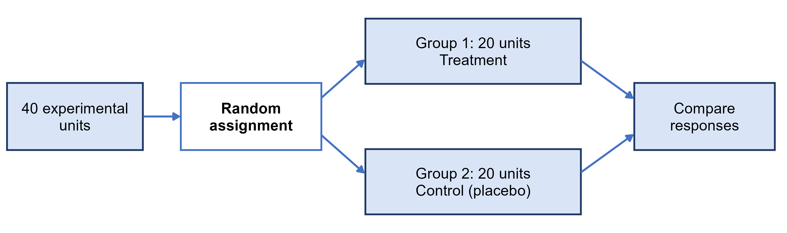
```

### Randomized block design

A **block** is a group of units that are similar in a way that we expect to affect the response.
Blocks are formed <i>before</i> the treatments are assigned. In a **randomized block design**, the
random assignment is done separately within each block, and the treatments are compared within
blocks.

```{r, echo=FALSE, out.width='85%', fig.align='center'}
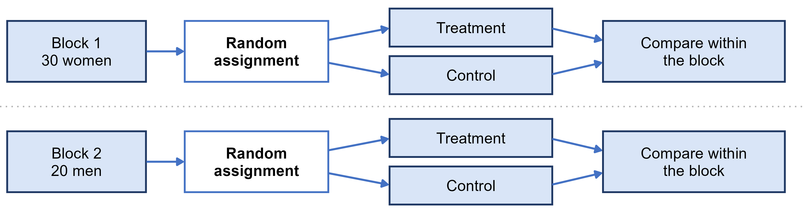
```

For example, suppose men and women respond differently to a treatment. In a completely randomized
design, that difference would add to the variation within each treatment group. Blocking on sex
removes this extra variation, which makes a real treatment effect easier to detect. You can think of
blocking as the experimental design version of stratifying in sampling.

### Matched pairs design

A **matched pairs design** is a special kind of block design where each block is a pair of very
similar units, such as twins or two plots of land side by side. Within each pair, we flip a coin to
decide which unit gets which treatment. Another option is to have each subject serve as their own
pair by receiving both treatments in a random order.

```{r, echo=FALSE, out.width='85%', fig.align='center'}
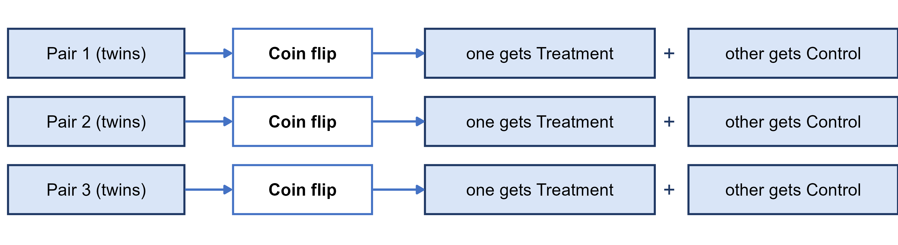
```

Measurements taken before and after on the same people (for example, blood pressure before and
after an exercise program) also give us paired data. However, there is no random order and no
control group, so anything else that changed between the two measurements is confounded with the
program. This makes before-and-after measurements much weaker evidence than a randomized matched
pairs experiment.

### Practice: design the study

**Practice:** *(Adapted from the textbook's Try It 1.21.)* Suppose you want to know whether texting
slows down how quickly a driver reacts when the car ahead of them brakes.

* What are the explanatory variable, the response variable, and the treatments?
* What design would you use?
* Can the experiment be blinded?

Here is one way to think about it:

* The explanatory variable is whether or not the driver is texting, the response variable is
  reaction time, and the treatments are driving while texting and driving only.
* We could randomly split drivers into a texting group and a driving-only group, but reaction times
  vary a lot from person to person. A **matched pairs** design is better here. Each driver does
  both, in a random order, and is compared with themselves.
* The drivers can't be blinded since they know when they are texting, but the person measuring
  reaction times can be.

## Random sampling vs. random assignment

Chance plays two different roles in a study, and each one lets us draw a different kind of
conclusion:

```{r, echo=FALSE, out.width='80%', fig.align='center'}
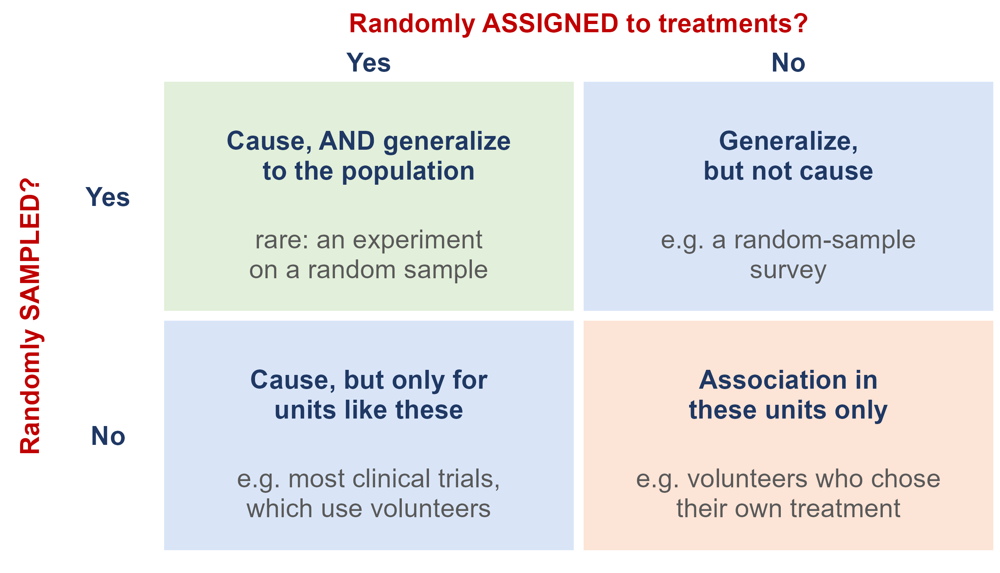
```

* **Random sampling** allows us to **generalize** from the sample to the population it was drawn
  from.
* **Random assignment** allows us to conclude **cause and effect**.

Most studies only have one of the two. For example, a clinical trial of volunteers can establish
that a vaccine works, but strictly speaking only for people similar to those volunteers. On the
other hand, a survey based on a random sample can describe a whole population, but it can't explain
why its variables are related.

## Ethics

Collecting and using data may not seem like something that raises ethical concerns, but like any
human endeavor it does, especially when the data are about people.

### Example: the Facebook emotional contagion experiment

For one week in January 2012, Facebook changed the News Feeds of 689,003 users. For some users,
posts with positive emotional content were less likely to show up, and for others, posts with
negative content were less likely to show up. The study was published in 2014, and the paper stated
that the research "was consistent with Facebook's Data Use Policy, to which all users agree prior to
creating an account on Facebook, constituting informed consent for this research"
([Kramer, Guillory and Hancock, 2014](https://pmc.ncbi.nlm.nih.gov/articles/PMC4066473/)).

The journal had concerns. Its Editorial Expression of Concern said it was "a matter of concern that
the collection of the data by Facebook may have involved practices that were not fully consistent
with the principles of obtaining informed consent and allowing participants to opt out." Because
Facebook is a private company, it was not bound by the federal rules for human-subjects research.
Cornell University's review board decided that its researcher, who only saw the results, was not
directly engaged in human research, so no review was required
([PNAS Expression of Concern, via Retraction Watch](https://retractionwatch.com/2014/07/03/rapid-mood-swing-pnas-issues-expression-of-concern-for-controversial-facebook-study/)).
The takeaway is that clicking "I agree" on a terms-of-service page is not informed consent, even for
a well-designed experiment.

### Honest data

Ethics also means being honest with data. An investigation of the social psychologist Diederik
Stapel found that he had created and altered datasets, and the falsified data tainted more than 55
papers he authored and 10 Ph.D. dissertations he supervised (Section 1.4 of the textbook). But
problems don't have to be that big to matter. Example 1.22 in the textbook describes a researcher
surveying households in a community who:

* picks a block where they already know a lot of the neighbors. This is a convenience sample, which
  is biased, and it is misleading to present it as representative.
* skips four houses where nobody was home and never goes back. This is nonresponse, which may leave
  out groups like working families.
* fills in four forms with answers copied from the neighbors. This is fabricated data, which is
  never acceptable.

### Why the rules exist

Many of the rules we have today came about because of past abuses. In the U.S. Public Health
Service's Untreated Syphilis Study at Tuskegee (1932-1972), 399 Black men with syphilis were
followed for decades without being told the true purpose of the study, and without being offered
penicillin once it became the treatment of choice ([CDC](https://www.cdc.gov/tuskegee/about/index.html)).
The public response led to the National Research Act of 1974 and the 1979 **Belmont Report**, which
lays out three principles
([HHS Office of Research Integrity](https://ori.hhs.gov/content/chapter-3-The-Protection-of-Human-Subjects-belmont-report-1979)):

* **Respect for persons** - people get to decide for themselves whether to take part in research.
* **Beneficence** - do no harm, maximize the possible benefits, and minimize the possible risks.
* **Justice** - the burdens and benefits of research should be shared fairly.

### Research ethics today

Some of the ethical requirements that apply to studies today are:

* **Informed consent** - subjects are told the purpose, procedures, and risks of the study ahead of
  time, and they can refuse or withdraw at any time.
* **Confidentiality** - information about individuals is protected and is never released in a way
  that could identify them.
* **Institutional Review Boards (IRBs)** - these boards review studies involving human subjects
  before they begin. At the University of Idaho, the IRB is overseen by the
  [Office of Research Assurances](https://www.uidaho.edu/research/our-people#res-assurance), under
  [FSH 5200, Human Subject Research](https://www.uidaho.edu/policies/fsh/5/5200).

Keep in mind that ethics also applies to data you didn't collect yourself. If you use a public
dataset for your project, make sure it doesn't contain any information that could identify
individuals.

## Sources

* AAPOR Task Force on 2020 Pre-Election Polling (2021). *Executive Summary*. American Association
  for Public Opinion Research.
* AP-NORC Center for Public Affairs Research and USAFacts (2026). *State of the Facts 2026*.
  <https://apnorc.org/projects/state-of-the-facts-2026/> (report:
  <https://apnorc.org/wp-content/uploads/2026/09/State_of_the_facts_2026.pdf>)
* Blackburn, I. and Kunadian, V. (2026). Hormone replacement therapy and cardiovascular risk in
  postmenopausal women. *European Heart Journal Open*, 6(2), oeag054.
  <https://doi.org/10.1093/ehjopen/oeag054>
* Bofill Rodriguez, M., Yong, L. N., Mirkov, S., Bekos, C., Lethaby, A. and Farquhar, C. (2025).
  Long-term hormone therapy for perimenopausal and postmenopausal women. *Cochrane Database of
  Systematic Reviews*, 11, CD004143. <https://doi.org/10.1002/14651858.CD004143.pub6>
* Dai, J., Dai, W., Heianza, Y. and Qi, L. (2026). Nighttime light exposure and cardiac structure
  and function. *European Heart Journal*. <https://doi.org/10.1093/eurheartj/ehag563>
* European Society of Cardiology (2026, September 10). Too much light at night changes the shape and
  working of the heart. Press release.
  <https://www.escardio.org/news/press/press-releases/too-much-light-at-night-changes-the-shape-and-working-of-the-heart/>
* Freedman, N. D., Park, Y., Abnet, C. C., Hollenbeck, A. R. and Sinha, R. (2012). Association of
  coffee drinking with total and cause-specific mortality. *New England Journal of Medicine*,
  366(20), 1891–1904. <https://doi.org/10.1056/NEJMoa1112010>
* Grodstein, F. et al. (1996). Postmenopausal estrogen and progestin use and the risk of
  cardiovascular disease. *New England Journal of Medicine*, 335, 453–461.
* Hill, A. B. (1965). The environment and disease: association or causation? *Proceedings of the
  Royal Society of Medicine*, 58, 295–300.
* Humphrey, L. L., Chan, B. K. and Sox, H. C. (2002). Postmenopausal hormone replacement therapy
  and the primary prevention of cardiovascular disease. *Annals of Internal Medicine*, 137, 273–284.
* Illowsky, B. and Dean, S. (2023). *Introductory Statistics 2e*, Sections 1.2 and 1.4–1.6.
  OpenStax. <https://openstax.org/details/books/introductory-statistics-2e>
* Kennedy, C. and Hartig, H. (2019). Response rates in telephone surveys have resumed their
  decline. Pew Research Center.
* Kim, H.-S. et al. (2026). Coffee consumption and improved liver outcomes: clinical, imaging, and
  proteomic evidence from the UK Biobank. *Clinical Gastroenterology and Hepatology*.
  <https://doi.org/10.1016/j.cgh.2026.04.035>
* Kramer, A. D. I., Guillory, J. E. and Hancock, J. T. (2014). Experimental evidence of
  massive-scale emotional contagion through social networks. *PNAS*, 111(24), 8788–8790.
  <https://doi.org/10.1073/pnas.1320040111>
* Lu, T. F. et al. (2026). Long-term systemic outcomes of postmenopausal hormone replacement
  therapy by age at menopause: a real-world cohort study. *Human Reproduction Open*, 2026(3),
  hoag072. <https://doi.org/10.1093/hropen/hoag072>
* Manson, J. E. et al. (2019a). Vitamin D supplements and prevention of cancer and cardiovascular
  disease. *New England Journal of Medicine*, 380(1), 33–44. <https://doi.org/10.1056/NEJMoa1809944>
* Manson, J. E. et al. (2019b). Marine n−3 fatty acids and prevention of cardiovascular disease and
  cancer. *New England Journal of Medicine*, 380(1), 23–32. <https://doi.org/10.1056/NEJMoa1811403>
* Marcus, G. M., Hu, F. B., van Dam, R. M. et al. (2026). Caffeine and cardiovascular disease: a
  scientific statement from the American Heart Association. *Circulation*, 154, e345–e355.
  <https://doi.org/10.1161/CIR.0000000000001454>
* The Menopause Society (2025, October 10). *Oral or transdermal hormone therapy? The mental health
  risks are not the same*. Press release.
  <https://menopause.org/press-releases/oral-or-transdermal-hormone-therapy-the-mental-health-risks-are-not-the-same>
* Mercer, A., Kennedy, C. and Keeter, S. (2024). Online opt-in polls can produce misleading results,
  especially for young people and Hispanic adults. Pew Research Center.
* Moseley, J. B. et al. (2002). A controlled trial of arthroscopic surgery for osteoarthritis of
  the knee. *New England Journal of Medicine*, 347(2), 81–88. <https://doi.org/10.1056/NEJMoa013259>
* Münzel, T., Kuntic, M. and Daiber, A. (2026). The dark night as a cardiovascular vital sign:
  personal light exposure, subclinical cardiac remodelling, and the urban exposome. *European Heart
  Journal*, ehag650. <https://doi.org/10.1093/eurheartj/ehag650>
* NORC at the University of Chicago (n.d.). About AmeriSpeak.
  <https://www.norc.org/services-solutions/amerispeak/about.html>
* Polack, F. P. et al. (2020). Safety and efficacy of the BNT162b2 mRNA Covid-19 vaccine. *New
  England Journal of Medicine*, 383(27), 2603–2615. <https://doi.org/10.1056/NEJMoa2034577>
* U.S. Department of Health and Human Services (2014). *The Health Consequences of Smoking — 50
  Years of Progress: A Report of the Surgeon General*.
* U.S. Food and Drug Administration (2025, November 10). *FDA requests labeling changes related to
  safety information to clarify the benefit/risk considerations for menopausal hormone therapies*.
  <https://www.fda.gov/drugs/drug-alerts-and-statements/fda-requests-labeling-changes-related-safety-information-clarify-benefitrisk-considerations>
* U.S. Food and Drug Administration (2026, February 12). *FDA approves labeling changes to
  menopausal hormone therapy products*.
  <https://www.fda.gov/news-events/press-announcements/fda-approves-labeling-changes-menopausal-hormone-therapy-products>
* Writing Group for the Women's Health Initiative Investigators (2002). Risks and benefits of
  estrogen plus progestin in healthy postmenopausal women. *JAMA*, 288(3), 321–333.
  <https://doi.org/10.1001/jama.288.3.321>
