```{r setup, include=FALSE}
knitr::opts_chunk$set(echo = TRUE)
library(knitr)
library(kableExtra)
library(ggplot2)
library(ggthemes)
library(ggpubr)
library(latex2exp)

path = 'Data/'

# every number quoted on this page is computed here, from the same data the
# Lecture 11 and 12 figures use, so the text cannot drift from the figures
h  <- read.csv(paste0(path, 'heights.csv'))
fh <- h$HEIGHT[h$GENDER == 'Female']
mh <- h$HEIGHT[h$GENDER == 'Male']
HM <- round(mean(fh), 1); HS <- round(sd(fh), 2)
z70 <- round((70 - HM) / HS, 2)
stopifnot(length(fh) == 262, HM == 65.4, HS == 3.38, z70 == 1.36)

q  <- quantile(fh, c(0.25, 0.75), type = 7); iq <- as.numeric(q[2] - q[1])
f_lo <- as.numeric(q[1] - 1.5 * iq); f_hi <- as.numeric(q[2] + 1.5 * iq)
s_lo <- mean(fh) - 2 * sd(fh);       s_hi <- mean(fh) + 2 * sd(fh)
n_iqr <- sum(fh < f_lo | fh > f_hi); n_2s <- sum(fh < s_lo | fh > s_hi)
stopifnot(n_iqr == 13, n_2s == 6, sum(fh == 72) == 7)

eu <- read.csv(paste0(path, 'EU_CO2.csv'))
eu_m <- round(mean(eu$CO2), 1); eu_s <- round(sd(eu$CO2), 1)
stopifnot(nrow(eu) == 28, eu_m == 7.9, eu_s == 3.6)

fmt <- function(x, d = 2) formatC(x, format = 'f', digits = d)
tab <- function(df, ...) kable(df, format = 'html', row.names = FALSE, escape = FALSE, ...) %>%
  kable_classic(full_width = FALSE, html_font = "Cambria") %>%
  kable_styling(bootstrap_options = 'striped')
```

<!--
  SCOPE OF THIS PAGE (Fall 2026 rewrite, Sept 28 2026).

  Week 6 is three lectures (see Course_Schedule.Rmd, the date source of truth):
    Mon Sept 28  Lecture 12  the normal distribution, the empirical rule, z-scores,
                             identifying outliers, transformations
                             lecture_slides/Week 6/Week6_Lecture12_Slides_9_28_2026.pptx
                             (its first slides are the four normal-distribution slides
                             Lecture 11 reached on Fri Sept 25)
    Wed Sept 30  Lecture 13  sampling distributions, standard error, margin of error,
                             statistical significance
    Fri Oct 2    Lecture 14  introduction to probability, random variables, discrete
                             probability distributions

  Sources. This page rewrites the 2024 notes that used to be spread over two pages:
  "The normal distribution and z-scores", "Density Curves", the empirical rule,
  "Standardizing Observations" and "Sampling Distributions" (2024 Week 5 page), and
  "Connection with statistical inference", "Introduction to probability" and
  "Discrete random variables" (2024 Week 6 page). Terms follow OpenStax Introductory
  Statistics 2e, Sections 3.1-3.3, 4.1-4.2, 6.1-6.2 and 7.1. What changed:
    * the invented examples (a simulated "Georgia athletes" histogram, simulated
      Idler's Rest cedar trunks, the 1990s cell-phone-accident table) are replaced by
      real data already used in class: the 262 female heights in Data/heights.csv,
      the Week 3 cereals and the World Bank EU emissions;
    * figures for Lecture 12 are the slide figures themselves, from
      assets/make_lecture11_figures.R and assets/make_lecture12_figures.R, which
      assert every number the slides print;
    * probability examples avoid the Homework 2 problems (3 coin flips, band/sport,
      the card deck, the urn, Moscow weather, the tree volumes) so the notes do not
      hand out the homework answers.
  Lecture 12 opens (after the review slides) by introducing the normal
  distribution properly - three real bell shapes, the definition, the two
  parameters, why it matters (averages of dice), density curves and "area is
  proportion" on the Central Park Januaries. It then follows the order normal
  distribution -> standard normal -> z-scores -> examples (incl. textbook Try It 6.2)
  -> empirical rule -> outliers, and the sections below follow the deck.
  Its transformations slide is the 2024 Lecture 7 slide 14 ("A note about
  transformations of variables"). The deck also ends with the margin-of-error
  block from the 2024 Lecture 8 (slides 6-10: two samples, sampling distribution,
  margin of error, statistical significance), rebuilt on the heights data with the
  same seeds as the "Sampling distributions" section below, so either lecture can
  cover it: if Sept 28 doesn't reach it, it opens Sept 30.
  The 2024 "Deriving sampling distributions" section (poker aces, Coho salmon) moved
  to the Week 7 page, next to the central limit theorem it sets up.
-->

This week has three parts. On **Monday** we finish the tools for describing a single distribution:
the normal distribution, $z$-scores, and what they let us say about outliers. On **Wednesday** we use
those tools on a new kind of distribution, the distribution of a *statistic*, which is the bridge
from describing data to drawing conclusions from it. On **Friday** we start probability, the
language that makes that bridge precise.

# The normal distribution

```{r cp-setup, include=FALSE}
cp  <- read.csv(paste0(path, 'central_park_temps.csv'))
jan <- cp$JAN
CM <- round(mean(jan), 1); CS <- round(sd(jan), 1)
AREA <- round(pnorm(36, CM, CS) - pnorm(28, CM, CS), 2)
N_IN <- sum(jan >= 28 & jan < 36)
stopifnot(length(jan) == 150, CM == 32.0, CS == 4.6, AREA == 0.62, N_IN == 92)
```

## The data

```{r, include=FALSE}
# first five rows of a data set, then a row of ellipses ("it goes on")
head5 <- function(df) {
  top <- head(df, 5); top[] <- lapply(top, as.character)
  rbind(top, setNames(as.list(rep('…', ncol(df))), names(df)))
}
```

Two real data sets run through the first half of this week.

**Female student heights.** A survey of `r nrow(h)` college students recorded each student's height
and gender; `r length(fh)` of them are women.

* $X$ = the height of a female student, in inches

```{r, echo=FALSE}
tab(head5(h[h$GENDER == 'Female', ]))
```

The file is sorted from shortest to tallest, which is why the first rows are all short. $n = `r length(fh)`$.

**Central Park in January.** The National Weather Service has recorded the mean temperature in Central
Park, New York, for every month since 1869.

* $X$ = the mean January temperature in Central Park in a given year, in °F

```{r, echo=FALSE}
tab(head5(cp[, c('YEAR', 'JAN', 'FEB', 'MAR', 'DEC', 'ANNUAL')]))
```

$n = `r nrow(cp)`$ years, `r min(cp$YEAR)` to `r max(cp$YEAR)`. We use only the January column.

## What do these have in common?

Here are three distributions that have nothing to do with each other: the heights of the
`r length(fh)` female students in our running data set, the mean January temperature in Central Park,
New York, in each of the `r length(jan)` years from `r min(cp$YEAR)` to `r max(cp$YEAR)`, and the
average of ten rolls of a fair die.

```{r, echo=FALSE, out.width='90%', fig.align='center'}
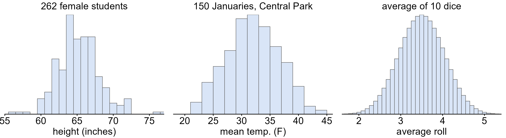
```

* What do the three have in common?

Each one is single-peaked, symmetric and bell shaped: most values pile up near the middle, and they
thin out at the same rate on both sides. This shape turns up so often that it has a name.

## The normal distribution

* A **normal distribution** is a symmetric, bell-shaped curve with its peak at the mean.

Below, the same three distributions each have a normal curve drawn over them. It is the same
*shape* each time; only its center and its spread change.

```{r, echo=FALSE, out.width='90%', fig.align='center'}
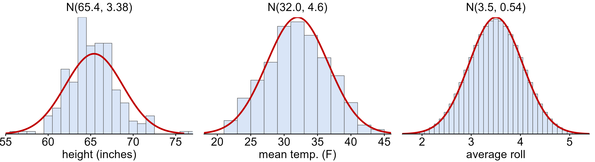
```

The heights follow the curve least closely: they are lumpier, and a few students sit well out in
the tails. No real data set is exactly normal. The normal curve is a **model**, and the question is
always whether it is close enough to be useful.

## Two parameters: $\mu$ and $\sigma$

Every normal curve is pinned down by just two numbers, its **parameters**. We write

$$X \sim N(\mu, \sigma)$$

for a variable that is normally distributed with mean $\mu$ and standard deviation $\sigma$. The
titles on the curves above are exactly this: the heights are roughly $N(`r HM`, `r HS`)$ and the
January temperatures roughly $N(`r fmt(CM, 1)`, `r fmt(CS, 1)`)$.

* The mean $\mu$ **locates the center**. Changing $\mu$ slides the curve along the axis without
  changing its shape.
* The standard deviation $\sigma$ **sets the spread**. A small $\sigma$ gives a tall, narrow curve; a
  large $\sigma$ gives a short, broad one. The center does not move.

```{r, echo=FALSE, out.width='90%', fig.align='center'}
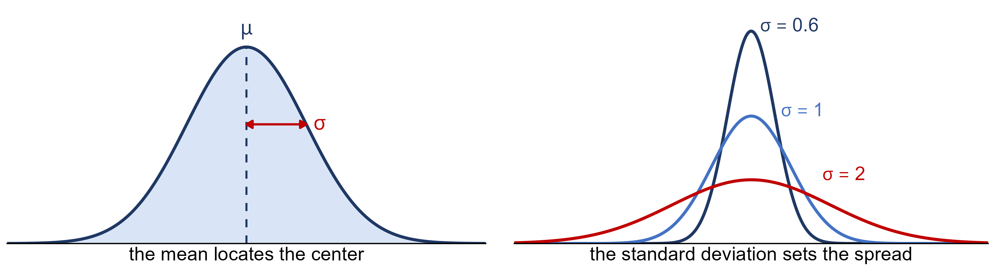
```

Greek letters are for the population ($\mu$, $\sigma$) and Roman letters for a sample
($\bar{x}$, $s$), the same convention as parameters and statistics in the Weeks 4-5 notes.

## Why is the normal so important?

Why would one curve matter so much? Look at what happens when we average dice. One die is flat:
every face is equally likely. The average of two dice is already peaked in the middle, and the
average of five or ten is a bell.

```{r, echo=FALSE, out.width='90%', fig.align='center'}
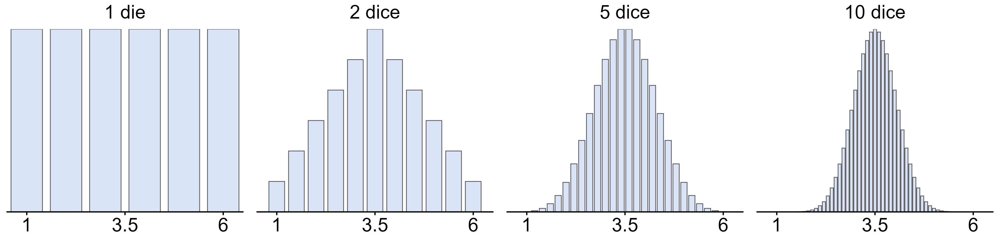
```

* **Many measurements are approximately normal**, especially physical ones such as heights, and
  quantities such as a month's average temperature that are themselves averages of many days.
* **Averages of random values become normal, whatever the individual values look like.** The dice
  above start out flat, not bell shaped at all. This is the central limit theorem, and it is why a
  *sample mean* is approximately normal. That is Wednesday's topic.
* **Most of the methods in the rest of this course are built on it**: margins of error, confidence
  intervals and hypothesis tests all lean on the normal curve.

## Density curves

What exactly *is* the smooth curve we keep drawing over histograms? A histogram's bars are counts
inside intervals that *we* chose. A continuous variable, such as a temperature, has no natural
intervals, so in theory its distribution is better drawn as a smooth curve.

* A **density curve** is a smooth curve that describes a distribution. It never dips below the axis,
  and the total area under it is exactly 1.

```{r, echo=FALSE, out.width='70%', fig.align='center'}
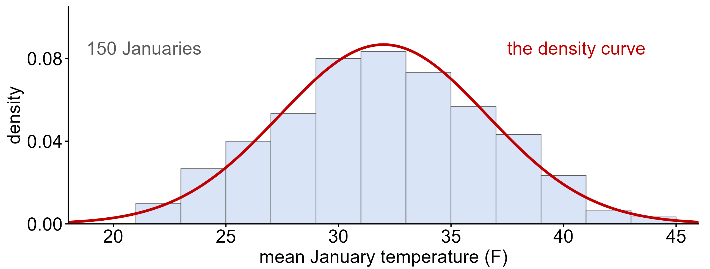
```

The bars are the `r length(jan)` Januaries we actually recorded. The curve is the distribution behind
them, a model of what January in Central Park looks like in the long run. The vertical axis is
labelled **density**, and it is worth getting a rough feel for what that means.

## Area under the curve is proportion

The January temperatures have $\bar{x} = `r fmt(CM, 1)`$°F and $s = `r fmt(CS, 1)`$°F. What fraction of
Januaries averaged between 28°F and 36°F?

```{r, echo=FALSE, out.width='90%', fig.align='center'}
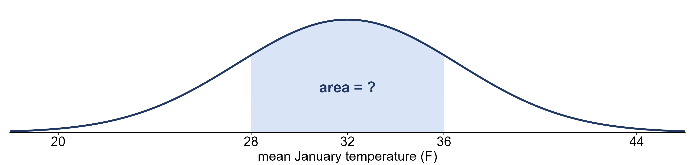
```

On a density curve, **the area under the curve over an interval is the proportion of values in that
interval**. The shaded area works out to `r fmt(AREA, 2)`. In the actual data, `r N_IN` of the
`r length(jan)` Januaries fall in that range, a proportion of `r fmt(N_IN / length(jan), 2)`. The model
and the data agree closely.

That gives a loose working idea of **probability density**:

* The **height** of the curve is the density. It shows where values crowd together: the curve is
  tallest near 32°F because that is where Januaries are most common. The height on its own is *not*
  a proportion or a probability.
* The **area** under the curve is the proportion. If we pick one January at random, the area over an
  interval is the *probability* that it lands in that interval. That is why the total area has to
  be 1: every January lands somewhere.

We will make this precise when we reach probability on Friday and continuous random variables in
Week 7. For now: **height means crowded, area means how many**. Everything else about the normal
distribution this week, including the empirical rule, the $z$-table and `pnorm`, is a way of finding
areas under this curve.

## The standard normal distribution

There are infinitely many normal curves, one for every choice of $\mu$ and $\sigma$. One of them gets
a name of its own.

* The **standard normal distribution** is the normal distribution with mean 0 and standard deviation
  1, written $Z \sim N(0, 1)$.

Every normal distribution is a shifted and stretched copy of this one. If we measure how far each
value is from $\mu$ **in units of $\sigma$**, any normal curve turns into $N(0, 1)$. Below, the heights
of the `r length(fh)` female students are drawn twice: once in inches, and once as the number of
standard deviations each height is from the mean.

```{r, echo=FALSE, out.width='90%', fig.align='center'}
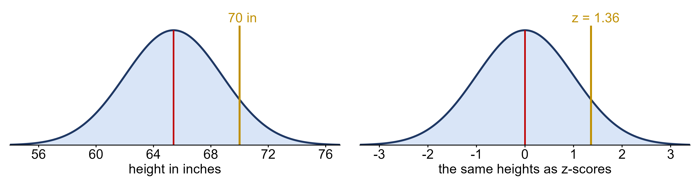
```

It is the same curve; only the labels on the axis change. That "number of standard deviations from
the mean" is called a $z$-score, and it is the next topic.

# $z$-scores

## The data: breakfast cereals

The twenty US breakfast cereals from Week 3, with their sodium and sugar content.

* $Y$ = the sodium content of a breakfast cereal, in mg

```{r, echo=FALSE}
cereal <- read.csv(paste0(path, 'cereal.csv'))
stopifnot(nrow(cereal) == 20)
tab(head5(cereal))
```

$n = `r nrow(cereal)`$ cereals.

## Which observation is more extreme?

How do we say how far a value sits from the center of its distribution? So far,
"far from the center" has been measured in the units of whatever we happened to be measuring. That
makes it impossible to compare across variables. Consider two samples, each with $n = 20$
observations:

* $X$ = an exam score (points): $\bar{x} = 74$, $s = 8$, and one student scored $x = 90$.
* $Y$ = the sodium in a breakfast cereal (mg): $\bar{y} = 167$, $s = 77$, and one cereal has
  $y = 290$.

Which observation is more extreme? The cereal is $123$ mg above its mean and the student only $16$
points above theirs, but points and milligrams are different scales, so the two raw deviations can't
be compared. The fix is to measure each deviation in **standard deviations of its own variable**:

$$\text{student: } \frac{90 - 74}{8} = \frac{16}{8} = 2.0 \qquad\qquad \text{cereal: } \frac{290 - 167}{77} = \frac{123}{77} \approx 1.6$$

The student is 2.0 standard deviations above the mean and the cereal only 1.6, so the exam score
is the more extreme of the two, even though its raw deviation is far smaller. On a normal curve this
is the natural yardstick, because $\sigma$ is exactly what sets the curve's spread.

## Measuring a deviation in standard deviations

Recall the twenty US breakfast cereals from the Week 3 notes, with mean sodium $\bar{x} = 167$ mg and
standard deviation $s \approx 77$ mg. The cereal furthest above the mean is Raisin Bran, at 340 mg.

```{r, echo=FALSE, out.width='85%', fig.align='center'}
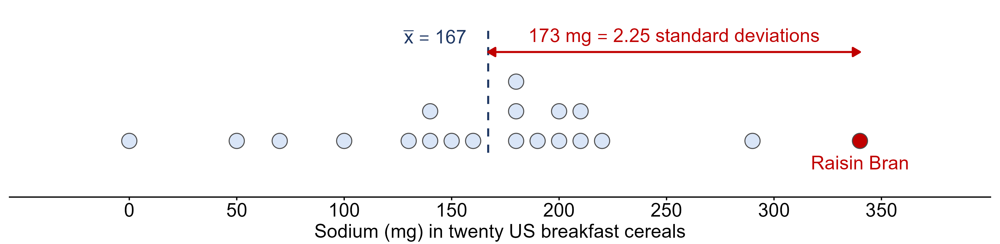
```

Raisin Bran is $340 - 167 = 173$ mg above the mean, which is $173/77 \approx 2.25$ standard
deviations. Dividing a deviation by the standard deviation strips the units off, and what is left
means the same thing no matter what was measured. That number is the **$z$-score**:

$$z = \frac{x - \bar{x}}{s} = \frac{\text{observation} - \text{mean}}{\text{standard deviation}}$$

A positive $z$ is above the mean and a negative $z$ is below it. A cereal at $z = 2.25$ and a student
at $z = 2.25$ are equally unusual within their own distributions, even though one is milligrams and
the other is exam points.

For a population the $z$-score uses the parameters, $z = (x - \mu)/\sigma$; for a sample it uses the
statistics, $z = (x - \bar{x})/s$. To go the other way, $x = \bar{x} + z\,s$. Converting every value of
a variable to a $z$-score is called **standardizing**, and standardizing a normal variable gives the
standard normal distribution, $Z \sim N(0, 1)$.

### Example: a 70-inch student

Our running data set this week is the heights of the `r length(fh)` female students in
`heights.csv`, with $\bar{x} = `r HM`$ inches and $s = `r HS`$ inches. A student who is 70 inches tall
has

$$z = \frac{70 - `r HM`}{`r HS`} = `r z70`$$

She is `r z70` standard deviations above the mean: the gold line on the standard normal picture above.
Standardizing relabels the axis. It does not move a single student.

## Examples

### Example: Jerome's points

This one is Try It 6.2 from the textbook. Jerome averages 16 points a game with a standard deviation
of 4 points, so $X \sim N(16, 4)$. One night he scores 10 points. Fill in the blanks: $x = 10$ is ____
standard deviations to the ____ (right or left) of the mean ____.

$$z = \frac{10 - 16}{4} = -1.5$$

so $x = 10$ is **1.5** standard deviations to the **left** of the mean, **16**. A negative $z$-score
always means below the mean.

### Example: carbon emissions across the EU

The table below gives carbon dioxide emissions per person (metric tons) for the 28 member states of
the European Union, from the World Bank.

* $X$ = the carbon dioxide emissions per person in an EU country, in metric tons ($n = 28$)

```{r, echo=FALSE}
tab(eu, col.names = c('Country', 'Code', 'CO2 per person (metric tons)'), digits = 1)
```

The mean is $\bar{x} \approx `r eu_m`$ and the standard deviation $s \approx `r eu_s`$ metric tons.

* How many standard deviations above the mean is Luxembourg, at 21.4 tons per person?
  $$z = \frac{21.4 - 7.9}{3.6} = 3.75$$
* How high would a country's emissions have to be to sit 2 standard deviations above the mean?
  $$\bar{x} + 2s = 7.9 + 2(3.6) = 15.1 \text{ metric tons}$$
  Only Luxembourg clears that line; the next highest, Estonia, emits 13.7.

# The empirical rule and outliers

## The empirical rule

Every normal curve has the same proportions once distance is measured in standard deviations.

* The **empirical rule** (the 68-95-99.7 rule): in a bell-shaped distribution, about **68%** of the
  values fall within 1 standard deviation of the mean, about **95%** within 2, and about **99.7%**
  within 3.

```{r, echo=FALSE, out.width='90%', fig.align='center'}
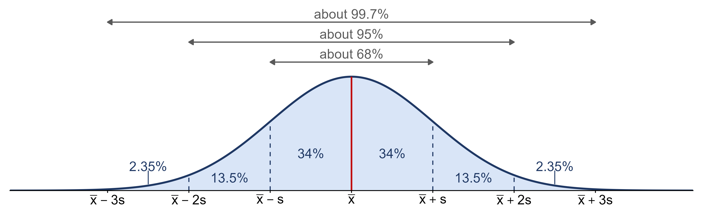
```

Because the curve is symmetric, the rule splits into pieces: 34% between the mean and one standard
deviation on each side, 13.5% between one and two, and 2.35% between two and three, leaving 0.15%
beyond three on each side. Putting pieces together answers most questions of this kind: for example
$50\% + 34\% = 84\%$ of values are below $\bar{x} + s$, and $50\% + 34\% + 13.5\% = 97.5\%$ are below
$\bar{x} + 2s$.

The rule is **only** for bell-shaped distributions. Applied to a skewed distribution it gives the
wrong answers.

### Practice: read $\sigma$ off a curve

**Practice:** estimate the standard deviation of each curve.

```{r, echo=FALSE, out.width='90%', fig.align='center'}
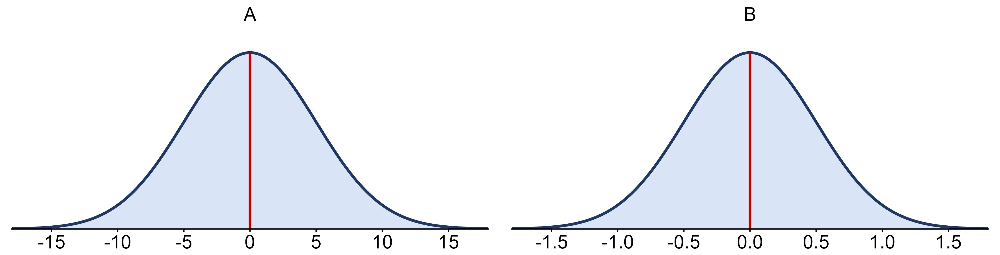
```

*A: $\sigma \approx 5$. B: $\sigma \approx 0.5$. Step out from the center until you have captured
roughly the middle two thirds of the curve (68%) and read that distance off the axis. The two
pictures are the same shape, so the shape alone tells you nothing about the spread: always check
the axis.*

### Example: back to that exam

Exam scores in a class are roughly bell shaped with $\bar{x} = 74$ and $s = 8$ points. What percentage
of scores falls in each shaded region?

```{r, echo=FALSE, out.width='90%', fig.align='center'}
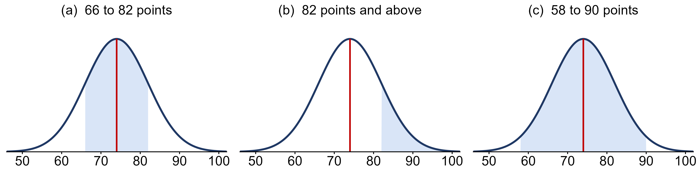
```

* (a) 66 to 82 is $\bar{x} \pm 1s$, so about **68%**.
* (b) 82 and above: 68% lie within $\pm 1s$, leaving 32% split evenly between the two tails, so
  about **16%**.
* (c) 58 to 90 is $\bar{x} \pm 2s$, so about **95%**.

Part (b) used the empirical rule and symmetry together. Notice that the student who scored 90 in
"Which observation is more extreme?" is exactly 2 standard deviations up: only about 2.5% of the class did
better.

## Identifying outliers: the two-standard-deviation rule

The empirical rule gives a natural definition of "unusual" for bell-shaped data.

* An **outlier** under the $\pm 2s$ rule is a value at least 2 standard deviations from the mean,
  $|z| \geq 2$. Only about 5% of the values of a bell-shaped distribution are that far out. A
  stricter version uses 3 standard deviations, about 0.3%.

```{r, echo=FALSE, out.width='90%', fig.align='center'}
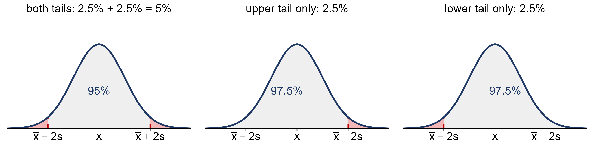
```

Ask first whether you care about one direction or both: about 2.5% of values lie beyond $+2s$ alone,
and 5% beyond $\pm 2s$ together. By this rule Luxembourg ($z = 3.75$) is an outlier, and a large one:
beyond 3 standard deviations is only about 0.15% of a bell-shaped distribution in each tail.

### When the two outlier rules disagree

You already know the $1.5 \times IQR$ rule from Week 3. Do the two rules flag the same students?

```{r, echo=FALSE, out.width='90%', fig.align='center'}
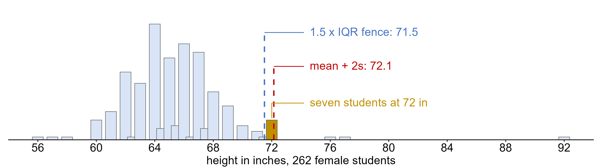
```

Not here. The IQR rule's upper fence is $Q_3 + 1.5 \times IQR = `r f_hi`$ inches and it flags
`r n_iqr` of the `r length(fh)` women; the $\pm 2s$ fence is $\bar{x} + 2s = `r fmt(s_hi, 1)`$ inches
and it flags only `r n_2s`. The seven students at 72 inches are outliers under one rule and ordinary
under the other. The single 92-inch value (almost certainly a data-entry error) drags the mean up and
inflates $s$, which pushes the $2s$ fence out past the 72s. The quartiles barely notice one extreme
value; the mean and standard deviation always do.

Neither rule is "the truth". An outlier is a value worth a second look, not a value to delete.

# Finding areas, and transformations

## Computing quantiles from a normal distribution

Our 70-inch student has $z = `r z70`$. What percentage of the women are shorter than she is? If her
$z$-score were exactly 1, the empirical rule would give $50\% + 34\% = 84\%$. But 1.36 is not 1, 2 or
3, and the empirical rule only knows whole standard deviations. For anything in between we need the
actual area under the curve to the left of $z$.

Because every normal distribution has the same areas once converted to $z$, one table covers all of
them. For decades that table was how it was done:

* The **standard normal table** ($z$-table) gives, for each $z$, the area under the standard normal
  curve to the **left** of $z$. Find the row for the first two digits of $z$ and the column for the
  third.

```{r, echo=FALSE, out.width='85%', fig.align='center'}
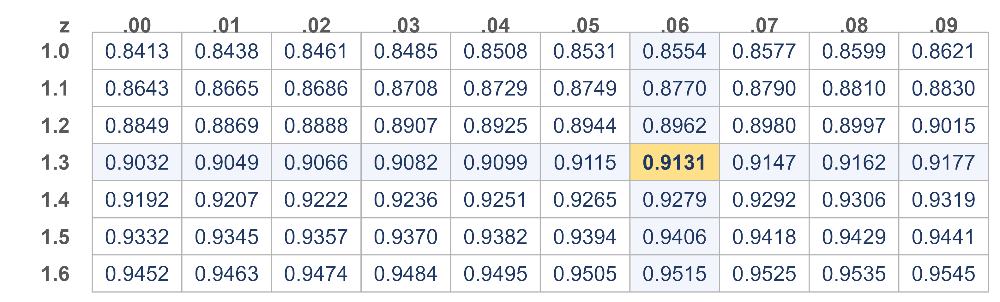
```

Row 1.3, column .06 gives $0.9131$, so about 91% of the women are shorter than 70 inches. (In the
actual data it is `r sum(fh < 70)` of `r length(fh)`, or `r fmt(100 * mean(fh < 70), 1)`%, which is
close: the heights are only approximately normal.) The area to the **right** of $z$ is one minus the
table value, here $1 - 0.9131 = 0.0869$.

Today software does the lookup. In R:

* **From a value to an area:** `pnorm(1.36)` returns `r fmt(pnorm(1.36), 4)`, the same number as
  the table. `pnorm(70, mean = 65.4, sd = 3.38)` skips the $z$-score step entirely.
* **From an area to a value:** `qnorm(0.90)` returns `r fmt(qnorm(0.90), 2)`, so 90% of any normal
  distribution lies below $\bar{x} + 1.28s$. For our heights that is
  $65.4 + 1.28(3.38) = `r fmt(65.4 + 1.28 * 3.38, 1)`$ inches.

The normal calculator on the course tools site (Resources → Tools/Calculators) does both. Either
way, you still have to know which number you are asking for.

## A note about transformations of variables

We often need to change the units of measurement of a variable, such as from Fahrenheit to Celsius,
feet to meters, or dollars to euros. Changing a variable like this is called a **transformation**, and
transformations come in two kinds.

* **Linear transformations** are made of adding, subtracting, multiplying and dividing. They take
  the form
  $$y = ax + b$$
  where $a$ is a *scaling* constant, $b$ is a *shifting* constant, $x$ is the original variable and
  $y$ is the transformed variable. Inches to centimeters is $a = 2.54$, $b = 0$.
    * The $z$-score is a linear transformation, with $a = 1/s$ and $b = -\bar{x}/s$.
    * Linear transformations **preserve the shape** of a variable's distribution.
* **Nonlinear transformations** include squaring, taking roots, logarithms and exponentiation.
    * They do **not** preserve the shape of a variable's distribution, which is often exactly why
      they are used: a logarithm, for example, can pull in a long right tail.

What a linear transformation does to the summaries:

* **Center** moves with the whole transformation: $\bar{y} = a\bar{x} + b$, and the median behaves the
  same way.
* **Spread** ignores the shift: $s_y = |a|\,s_x$ and $IQR_y = |a|\,IQR_x$. Adding $b$ slides every
  value by the same amount, so the distances between them do not change.
* **Shape** does not change at all. Skewness, gaps, clusters and outliers all survive exactly as they
  were.

### Example: inches to centimeters

Converting our `r length(fh)` heights to centimeters multiplies every value by 2.54, so $a = 2.54$ and
$b = 0$.

* The mean becomes $\bar{y} = 2.54(`r HM`) = `r fmt(2.54 * HM, 1)`$ cm and the standard deviation
  $s_y = 2.54(`r HS`) = `r fmt(2.54 * HS, 2)`$ cm.
* The 70-inch student is $2.54(70) = `r fmt(2.54 * 70, 1)`$ cm tall, and her $z$-score is
  $$z = \frac{`r fmt(2.54 * 70, 1)` - `r fmt(2.54 * HM, 1)`}{`r fmt(2.54 * HS, 2)`} = `r fmt((2.54 * 70 - 2.54 * HM) / (2.54 * HS), 2)`$$
  exactly what it was in inches.

Both the deviation and the standard deviation were multiplied by 2.54, and the factor cancels. A
$z$-score has no units, so it cannot depend on which units you chose. That is the whole reason a
$z$-score lets us compare an exam score with a breakfast cereal.

### A $z$-score does not make data normal

A common mistake is to think that standardizing a skewed variable straightens it out. It does not:
standardizing is a linear transformation, so it moves the center to 0 and sets the spread to 1 and
leaves the shape exactly as it found it.

```{r, echo=FALSE, out.width='85%', fig.align='center'}
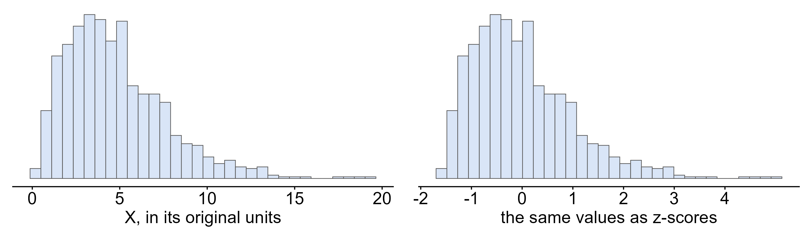
```

Both pictures show the same 1,000 values; the right-hand axis just reads in standard deviations. It
also means the empirical rule and the $\pm 2s$ outlier rule still do not apply to the picture on the
right.

# Sampling distributions

```{r sampling-setup, include=FALSE}
# the 262 female students play the role of the population for this section.
# Samples are drawn WITH replacement so that every draw comes from the full
# population, which is exactly the situation the sigma/sqrt(n) formula describes.
mu    <- mean(fh)
sigma <- sd(fh)
n     <- 20
SE    <- sigma / sqrt(n)
set.seed(2)
s1 <- sample(fh, n, replace = TRUE); s2 <- sample(fh, n, replace = TRUE)
xbar  <- replicate(10000, mean(sample(fh, n, replace = TRUE)))
xbar80 <- replicate(10000, mean(sample(fh, 80, replace = TRUE)))
within <- mean(abs(xbar - mu) <= 2 * SE)
set.seed(117)
ms <- sample(mh, n)
z_m <- (mean(ms) - mu) / SE
stopifnot(abs(mean(xbar) - mu) < 0.05, abs(sd(xbar) - SE) < 0.02,
          abs(mean(s1) - mu) < 2 * SE, abs(mean(s2) - mu) < 2 * SE,
          within > 0.94, within < 0.96, z_m > 5)
```

On Monday every distribution was a distribution of *data*: exam scores, sodium, heights. Today we
look at a distribution of a *statistic*, and it turns out to be the most important distribution in
the course.

## Statistics vary from sample to sample

Recall the distinction from the Weeks 4-5 notes. A **parameter** is a number that describes the
population, such as its mean $\mu$; a **statistic** is a number computed from a sample, such as
$\bar{x}$. We almost never know the parameter, so we use the statistic to estimate it.

To see what happens, let's pretend for a moment that we *do* know the population. Treat the
`r length(fh)` female students as the whole population, with $\mu = `r fmt(mu, 1)`$ inches and
$\sigma = `r fmt(sigma, 2)`$ inches, and take a random sample of $n = `r n`$ of them. The first sample
has $\bar{x}_1 = `r fmt(mean(s1), 2)`$ inches. A second random sample of 20 gives
$\bar{x}_2 = `r fmt(mean(s2), 2)`$ inches.

Neither sample mean equals $\mu$, and they don't equal each other. Nothing went wrong: a different
sample contains different people, so it gives a different answer. This is the **sampling error**
from the Weeks 4-5 notes, the difference between a statistic and the parameter it estimates, caused
purely by which units happened to be chosen.

## The sampling distribution

Now imagine repeating the process over and over: draw a sample of 20, compute $\bar{x}$, write it down,
and start again. Below are the means of 10,000 such samples.

```{r, echo=FALSE, message=FALSE, warning=FALSE, fig.height=4.5, fig.width=10}
pop_plot <- ggplot() +
  geom_histogram(aes(x = fh), binwidth = 1, color = 'black', fill = 'lightgrey') +
  geom_vline(xintercept = mu, color = 'red', linewidth = 1) +
  coord_cartesian(xlim = c(55, 93)) +
  theme_classic2() +
  labs(x = 'Height (inches)', y = 'Number of students',
       title = 'The population: 262 individual heights') +
  theme(axis.text = element_text(size = 12), axis.title = element_text(size = 14))

samp_plot <- ggplot() +
  geom_histogram(aes(x = xbar), binwidth = 0.25, color = 'black', fill = 'lightblue') +
  geom_vline(xintercept = mu, color = 'red', linewidth = 1) +
  coord_cartesian(xlim = c(55, 93)) +
  theme_classic2() +
  labs(x = TeX('Sample mean $\\bar{x}$ (inches)'), y = 'Number of samples',
       title = TeX('10,000 sample means, each from $n = 20$')) +
  theme(axis.text = element_text(size = 12), axis.title = element_text(size = 14))

ggarrange(pop_plot, samp_plot, nrow = 1)
```

* The **sampling distribution** of a statistic is the distribution of its values over all possible
  samples of the same size $n$ from the same population.

The name is new, but the idea is not. In Week 3 we saw that a sample mean moves from one sample to
the next (**sampling variation**) and measured that movement with the **standard error**,
$SE = s/\sqrt{n}$: the standard error is simply the standard deviation of the sampling distribution.
And the histograms in "A bigger sample does not fix bias" in the Weeks 4-5 notes, 5,000 simple random
samples against 5,000 Rec Center surveys, *were* sampling distributions: each bar counted how many of
the repeated surveys gave a particular estimate.

The two histograms are drawn on the same axis on purpose. Compare them:

* **Center.** The sample means are centered at `r fmt(mean(xbar), 2)` inches, right on $\mu$ (the red
  line). On average $\bar{x}$ neither overshoots nor undershoots, so it is **unbiased**.
* **Spread.** The sample means are far less spread out than the individual heights. One student can
  easily be 72 inches tall, but a sample of 20 students whose *average* is 72 inches essentially never
  happens, because the tall and short students in a sample cancel each other out.
* **Shape.** The individual heights are lumpy, with a stray value at 92 inches. The sample means form
  a smooth, symmetric bell. That is not luck: it is the central limit theorem, which we meet in
  Week 7.

## Standard error

The spread of a sampling distribution gets its own name, because it is exactly the "how far off
might my estimate be" that we care about.

* The **standard error** (SE) of a statistic is the standard deviation of its sampling distribution.
  For a sample mean it is
  $$SE(\bar{x}) = \frac{\sigma}{\sqrt{n}}$$
  and when $\sigma$ is unknown we estimate it with $s/\sqrt{n}$.

For our samples of 20, $SE = `r fmt(sigma, 2)`/\sqrt{20} = `r fmt(SE, 3)`$ inches. The standard
deviation of the 10,000 simulated means is `r fmt(sd(xbar), 3)`, so the formula matches what actually
happened.

Keep the two standard deviations straight. $\sigma = `r fmt(sigma, 2)`$ describes how far a single
student's height typically falls from $\mu$. $SE = `r fmt(SE, 2)`$ describes how far a whole sample's
*average* typically falls from $\mu$.

The $\sqrt{n}$ in the denominator means a bigger sample gives a smaller standard error, but slowly.
With $n = 80$, four times as many students, $SE = `r fmt(sigma, 2)`/\sqrt{80} = `r fmt(sigma / sqrt(80), 3)`$
(simulated: `r fmt(sd(xbar80), 3)`): quadrupling the sample only halves the error. And remember from
the Weeks 4-5 notes that a bigger sample shrinks the standard error but does nothing about bias.

## Margin of error

Because the sampling distribution of $\bar{x}$ is bell shaped, the empirical rule applies to it.
About 95% of sample means land within 2 standard errors of $\mu$. In the simulation,
`r fmt(100 * within, 1)`% of the 10,000 sample means did.

* The **margin of error** of an estimate measures how far we expect the estimate to fall from the
  true value of the parameter. It is a measure of the *between-sample* variability of the estimate:
  the largest distance between the parameter and an estimate that is **not an outlier**. Using the
  $\pm 2 \cdot SE$ rule for outliers, it is
  $$\text{margin of error} = 2 \cdot SE$$

```{r, echo=FALSE, out.width='90%', fig.align='center'}
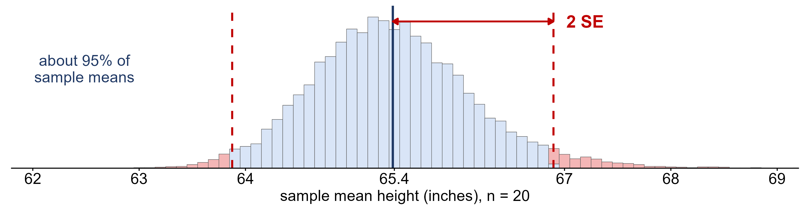
```

For samples of 20 heights the margin of error is $2(`r fmt(SE, 3)`) = `r fmt(2 * SE, 2)`$ inches: about
95% of samples give an $\bar{x}$ within $`r fmt(mu, 1)` \pm `r fmt(2 * SE, 1)`$ inches. A sample mean
further than that from $\mu$ would be an outlier in the sampling distribution, and therefore rare.

Don't confuse the two errors. The **sampling error** is how far *this particular* estimate happens
to be from the parameter, and we never know it, because we don't know the parameter. The **margin of
error** is a bound on how large the sampling error is likely to be, and we *can* compute it before
we have even taken the sample. When a poll reports "52% support, with a margin of error of 3
percentage points", this is the number they mean.

## Statistical significance

The margin of error also tells us when a result is too big to blame on chance.

* A result is **statistically significant** when it is too large to be explained by ordinary
  sampling variation, that is, when it would be unusual if chance alone were at work. By the
  $\pm 2 \cdot SE$ rule, that means further than 2 standard errors from what we would otherwise
  expect: a statistically significant result is one that **falls outside the margin of error**.

Suppose someone hands you a random sample of 20 students with a mean height of
`r fmt(mean(ms), 2)` inches and claims it came from our population of women. If it did, $\bar{x}$
should almost certainly be within $`r fmt(mu, 1)` \pm `r fmt(2 * SE, 1)`$ inches. Instead it is

$$z = \frac{`r fmt(mean(ms), 2)` - `r fmt(mu, 1)`}{`r fmt(SE, 3)`} = `r fmt(z_m, 1)`$$

standard errors away. Ordinary sampling variation essentially never produces that, so the result is
statistically significant: this sample almost certainly did not come from the female students. (It
didn't. It is a random sample of the `r length(mh)` male students in the same file.)

A sample mean of 66.0 inches, on the other hand, is $(66.0 - `r fmt(mu, 1)`)/`r fmt(SE, 3)` =
`r fmt((66.0 - mu) / SE, 1)`$ standard errors from $\mu$. That is well within the range of ordinary
variation, so it is **not** statistically significant. It could easily be a sample of our women.

Two cautions that will come up again and again:

* **Significant does not mean important.** It only means "not ordinary chance variation". With a
  large enough sample, a difference far too small to matter can be statistically significant.
* **Not significant does not mean no difference.** It means the data can't rule chance out, which
  can simply be a sign that the sample was too small.

This week's version of the idea is informal. From Week 8 on, confidence intervals and hypothesis
tests make it precise, but the logic never changes: compare what you saw with how much
variation chance alone would produce.

# Introduction to probability

Wednesday's argument rested on statements like "about 95% of sample means land within 2 standard
errors". Those are statements about **chance**, and statistics needs a precise language for chance.
That language is probability. When data are produced by random sampling or random assignment, the
outcomes follow the laws of probability, and that is what lets us say how often a method would give
the right answer if we used it many times.

## Random phenomena and long-run frequency

Tossing a coin, rolling a die and choosing a simple random sample are all **random** phenomena: the
result of any one trial can't be predicted, but there is a predictable pattern over many trials.

* The **probability** of an outcome is its long-run relative frequency: the proportion of times it
  would occur if the process were repeated a very large number of times. A probability is always
  between 0 and 1, inclusive.

This long-run pattern is guaranteed by the **law of large numbers**: as the number of independent
repetitions grows, the relative frequency of an outcome gets closer and closer to its probability.
The plot below follows the running proportion of heads over 5,000 simulated tosses of a fair coin.

```{r, echo=FALSE, message=FALSE, warning=FALSE, fig.height=4, fig.width=10, fig.cap='The running proportion of heads in 5,000 simulated fair-coin tosses. The red line is P(Heads) = 0.5.'}
set.seed(432)
flips <- rbinom(5000, 1, 0.5)
lln <- data.frame(trial = 1:5000, prop = cumsum(flips) / (1:5000))
ggplot(lln, aes(x = trial, y = prop)) +
  geom_line(linewidth = 0.8) +
  geom_hline(yintercept = 0.5, color = 'red', linewidth = 1) +
  scale_x_log10(breaks = c(1, 10, 100, 1000, 5000), labels = c('1', '10', '100', '1,000', '5,000')) +
  coord_cartesian(ylim = c(0, 1)) +
  theme_classic2() +
  labs(x = 'Number of tosses (log scale)', y = 'Proportion of heads') +
  theme(axis.text = element_text(size = 12), axis.title = element_text(size = 14))
```

In the first few tosses the proportion jumps all over the place: after 4 tosses, 3 heads (75%) is
not at all unusual. Over thousands of tosses it settles down to 0.5. The statistician Karl Pearson
actually did this by hand, tossing a coin 24,000 times and getting 12,012 heads, a proportion of
0.5005. Probability describes the long run; it says very little about any single toss.

## The language of probability

* A **chance experiment** (or trial) is any process with an uncertain result, such as rolling a die.
* An **outcome** is one possible result.
* The **sample space** $S$ is the set of all possible outcomes. For one roll of a six-sided die,
  $S = \{1, 2, 3, 4, 5, 6\}$.
* An **event** is any collection of outcomes, written with a capital letter. For example
  $A = \{\text{roll an even number}\} = \{2, 4, 6\}$. Its probability is written $P(A)$.

When every outcome in the sample space is **equally likely**,

$$P(A) = \frac{\text{number of outcomes in } A}{\text{total number of outcomes in } S}$$

so for a fair die $P(\text{even}) = 3/6 = 0.5$.

## The rules of probability

Four rules hold for every probability model.

1. **Probabilities are between 0 and 1:** $0 \leq P(A) \leq 1$. An event with probability 0 never
   happens; one with probability 1 always does.
2. **The whole sample space has probability 1:** the probabilities of all the outcomes add to 1.
3. **The complement rule:** the complement $A'$ ("not $A$") is everything in $S$ that is not in $A$,
   and $P(A') = 1 - P(A)$.
4. **The addition rule:** the event $A \text{ OR } B$ happens if $A$ happens, $B$ happens, or both.
   $$P(A \text{ OR } B) = P(A) + P(B) - P(A \text{ AND } B)$$
   The subtraction stops the outcomes in both events from being counted twice. Two events are
   **mutually exclusive** if they cannot happen together, so $P(A \text{ AND } B) = 0$ and the rule
   becomes simply $P(A) + P(B)$.

And one rule for events that don't influence each other:

5. **The multiplication rule for independent events:** two events are **independent** if knowing
   that one happened does not change the probability of the other. Then
   $$P(A \text{ AND } B) = P(A) \cdot P(B)$$

Mutually exclusive and independent are **not** the same thing. Mutually exclusive events can't both
happen, so knowing one happened tells you the other *didn't*, and that makes them strongly dependent.

### Example: one die, two dice

Roll a fair six-sided die.

* $P(\text{not a six}) = 1 - P(\text{six}) = 1 - 1/6 = 5/6$, by the complement rule.
* "Roll a 1" and "roll a 6" are mutually exclusive, so $P(1 \text{ OR } 6) = 1/6 + 1/6 = 1/3$.
* "Roll an even number" and "roll a number greater than 3" can happen together (on a 4 or a 6), so
  $$P(\text{even OR} > 3) = \frac{3}{6} + \frac{3}{6} - \frac{2}{6} = \frac{4}{6}$$
  Check it directly: the outcomes are $\{2, 4, 5, 6\}$, four of the six.

Now roll the die twice. The two rolls don't influence each other, so they are independent:

* $P(\text{six on both rolls}) = \frac{1}{6} \cdot \frac{1}{6} = \frac{1}{36}$.
* $P(\text{at least one six})$ is easiest through the complement. "At least one six" is the
  complement of "no sixes at all":
  $$P(\text{at least one six}) = 1 - P(\text{no six, no six}) = 1 - \frac{5}{6} \cdot \frac{5}{6} = \frac{11}{36} \approx 0.31$$

"At least one" questions almost always go faster through the complement.

### Example: probabilities from real data

The table below classifies the `r nrow(h)` students in `heights.csv` by gender and by whether they are
at least 70 inches tall. If we pick one student at random, every student is equally likely, so each
probability is just a count divided by `r nrow(h)`.

```{r, echo=FALSE}
ct <- table(h$GENDER, ifelse(h$HEIGHT >= 70, 'At least 70 in', 'Under 70 in'))
ct <- ct[, c('At least 70 in', 'Under 70 in')]
ct_df <- data.frame(Gender = rownames(ct), as.data.frame.matrix(ct), check.names = FALSE)
ct_df$Total <- rowSums(ct)
ct_df <- rbind(ct_df, data.frame(Gender = 'Total', `At least 70 in` = sum(ct[, 1]),
                                 `Under 70 in` = sum(ct[, 2]), Total = sum(ct), check.names = FALSE))
tab(ct_df)
nF <- sum(ct['Female', ]); nT <- sum(ct[, 'At least 70 in']); nFT <- ct['Female', 'At least 70 in']
N <- nrow(h)
stopifnot(N == 379, nF == 262, nT == 106, nFT == 19)
```

Let $F$ be the event that the student is female and $T$ that the student is at least 70 inches tall.

* $P(F) = `r nF`/`r N` = `r fmt(nF / N, 3)`$ and $P(T) = `r nT`/`r N` = `r fmt(nT / N, 3)`$.
* $P(F \text{ AND } T) = `r nFT`/`r N` = `r fmt(nFT / N, 3)`$: female **and** at least 70 inches.
* By the addition rule,
  $$P(F \text{ OR } T) = \frac{`r nF`}{`r N`} + \frac{`r nT`}{`r N`} - \frac{`r nFT`}{`r N`} = \frac{`r nF + nT - nFT`}{`r N`} = `r fmt((nF + nT - nFT) / N, 3)`$$
  Without the subtraction, the `r nFT` tall women would be counted twice.
* $F$ and $T$ are **not** independent. Among all students, `r fmt(100 * nT / N, 0)`% are at least 70
  inches, but among the women only $`r nFT`/`r nF` = `r fmt(100 * nFT / nF, 0)`\%$ are. Knowing the
  student is female changes the probability a lot. The multiplication rule would predict
  $P(F)\cdot P(T) = `r fmt(nF / N, 3)` \times `r fmt(nT / N, 3)` = `r fmt(nF * nT / N^2, 3)`$, far from
  the actual `r fmt(nFT / N, 3)`, which is another way to see it.

## Random variables

In statistics we usually care about a *number* attached to each outcome, not the outcome itself.

* A **random variable** is a numerical outcome of a chance experiment. Random variables are written
  with capital letters such as $X$, and a particular value with a lower-case letter such as $x$.

For example, toss a coin four times. Each outcome is a sequence such as HHTH, and there are
$2^4 = 16$ equally likely sequences. Let $X$ be the number of heads. HHTH gives $X = 3$, and TTTT gives
$X = 0$. $X$ can take the values 0, 1, 2, 3 and 4.

A random variable is **discrete** if we can list its possible values, like the count of heads, and
**continuous** if it can take any value in an interval, like a height. The normal distribution from
Monday is the most important continuous distribution; this week we focus on discrete ones.

## Discrete probability distributions

* The **probability distribution** of a discrete random variable lists its possible values and their
  probabilities. (The textbook calls this a *probability distribution function*, or PDF.)

For the four coin tosses, counting the sequences that give each number of heads:

```{r, echo=FALSE}
x4 <- 0:4; ways <- choose(4, x4)
tab(data.frame(x = x4,
               seqs = c('TTTT', 'HTTT, THTT, TTHT, TTTH', 'HHTT, HTHT, HTTH, THHT, THTH, TTHH',
                        'HHHT, HHTH, HTHH, THHH', 'HHHH'),
               ways = ways,
               p = paste0(ways, '/16 = ', fmt(ways / 16, 4))),
    col.names = c('$x$ (heads)', 'Sequences', 'Number of sequences', '$P(x)$'))
```

Every discrete probability distribution follows the same two rules as any probability model:

1. every probability is between 0 and 1, and
2. the probabilities add to 1. Here $1 + 4 + 6 + 4 + 1 = 16$ sequences, so the probabilities sum to
   $16/16 = 1$.

To find the probability of an event, add the probabilities of the values that make it up:

* $P(X \geq 3) = P(X = 3) + P(X = 4) = 4/16 + 1/16 = 5/16 = 0.3125$.
* $P(X \geq 1) = 1 - P(X = 0) = 1 - 1/16 = 15/16$, by the complement rule.
* $P(1 \leq X \leq 3) = (4 + 6 + 4)/16 = 14/16 = 0.875$.

A probability distribution can be drawn as a bar chart (a probability histogram) whose bars add to
1. Shading the bars that make up an event shows its probability as an area, the same idea as the area
under a density curve.

```{r, echo=FALSE, message=FALSE, warning=FALSE, fig.height=3.5, fig.width=10}
d4 <- data.frame(x = x4, p = ways / 16)
base <- function(fill, title) ggplot(d4, aes(x = factor(x), y = p)) +
  geom_col(fill = fill, color = 'black', width = 0.9) +
  theme_classic2() + labs(x = 'Number of heads, x', y = 'P(x)', title = title) +
  theme(axis.text = element_text(size = 12), axis.title = element_text(size = 14))
ggarrange(base('lightgrey', 'Probability distribution of X'),
          base(ifelse(x4 >= 3, 'lightblue', 'lightgrey'), TeX('Shaded: $P(X \\geq 3) = 5/16$')),
          nrow = 1)
```

## Mean and standard deviation of a discrete random variable

A probability distribution has a center and a spread, just like a distribution of data. The formulas
weight each value by its probability instead of by how often it appeared in a sample.

* The **mean**, or **expected value**, of a discrete random variable is
  $$\mu = \sum x \cdot P(x)$$
* The **variance** and **standard deviation** are
  $$\sigma^2 = \sum (x - \mu)^2 \cdot P(x) \qquad\qquad \sigma = \sqrt{\sigma^2}$$

The expected value is the long-run average of $X$ over many repetitions, which is the law of large
numbers again. It does not have to be a value $X$ can actually take, and it is not a prediction for
any single trial.

For the number of heads in four tosses, an expected value table lays the work out:

```{r, echo=FALSE}
mu4 <- sum(x4 * ways / 16); v4 <- sum((x4 - mu4)^2 * ways / 16)
stopifnot(mu4 == 2, v4 == 1)
tab(data.frame(x = x4, p = paste0(ways, '/16'),
               xp = paste0(x4, '(', ways, '/16) = ', fmt(x4 * ways / 16, 4)),
               dev = paste0('(', x4, ' - 2)^2(', ways, '/16) = ', fmt((x4 - 2)^2 * ways / 16, 4))),
    col.names = c('$x$', '$P(x)$', '$x \\cdot P(x)$', '$(x - \\mu)^2 \\cdot P(x)$'))
```

Adding the columns, $\mu = 0 + 0.25 + 0.75 + 0.75 + 0.25 = 2$ heads, and
$\sigma^2 = 0.25 + 0.25 + 0 + 0.25 + 0.25 = 1$, so $\sigma = 1$ head. Over many sets of four tosses the
average number of heads is 2, and a typical set is about 1 head away from that.

### Example: grade points on an exam

A STAT 251 exam grade on the four-point scale ($F = 0$, $D = 1$, $C = 2$, $B = 3$, $A = 4$) is a random
variable $X$ for a student chosen at random. Suppose its distribution is:

```{r, echo=FALSE}
gx <- 0:4; gp <- c(0.05, 0.10, 0.30, 0.25, 0.30)
stopifnot(abs(sum(gp) - 1) < 1e-12)
gmu <- sum(gx * gp); gsd <- sqrt(sum((gx - gmu)^2 * gp))
tab(data.frame(x = gx, g = c('F', 'D', 'C', 'B', 'A'), p = fmt(gp, 2)),
    col.names = c('$x$', 'Grade', '$P(x)$'))
```

* The probabilities add to $0.05 + 0.10 + 0.30 + 0.25 + 0.30 = 1$, so this is a valid distribution.
* The probability of doing better than a C is
  $P(X > 2) = P(X = 3) + P(X = 4) = 0.25 + 0.30 = 0.55$, or through the complement,
  $1 - (0.05 + 0.10 + 0.30) = 0.55$.
* The mean grade is
  $\mu = 0(0.05) + 1(0.10) + 2(0.30) + 3(0.25) + 4(0.30) = `r fmt(gmu, 2)`$, between a C and a B.
* The standard deviation is $\sigma = \sqrt{\sum (x - `r fmt(gmu, 2)`)^2 P(x)} = `r fmt(gsd, 2)`$
  grade points.

Next week we meet some named discrete distributions that come up again and again, starting with the
Bernoulli and the binomial, and then return to the sampling distribution with the central limit
theorem.

# Conclusion: what you should take away

## The normal distribution and $z$-scores

* $X \sim N(\mu, \sigma)$: the mean locates the center and the standard deviation sets the spread.
* **The empirical rule:** about 68%, 95% and 99.7% of values within 1, 2 and 3 standard deviations of
  the mean, for bell-shaped distributions only. With symmetry it also gives 84%, 16%, 97.5% and 2.5%.
* **The $z$-score** $z = (x - \bar{x})/s$ counts standard deviations from the mean. It has no units,
  which is what lets you compare values measured on different scales.
* **Outliers:** $|z| \geq 2$ is the usual flag for bell-shaped data. It can disagree with the
  $1.5 \times IQR$ rule, because one extreme value inflates $s$ but barely moves the quartiles.
* For $z$-scores between whole numbers, get the area from a $z$-table or from `pnorm`/`qnorm`.
* A linear transformation $y = ax + b$ moves the center, multiplies the spread by $|a|$ and never
  changes the shape, so a $z$-score does not make skewed data normal.

## Sampling distributions

* A statistic varies from sample to sample. Its **sampling distribution** is its distribution over
  all possible samples of size $n$.
* The sampling distribution of $\bar{x}$ is centered at $\mu$ and has **standard error**
  $SE = \sigma/\sqrt{n}$. Quadrupling $n$ halves the standard error.
* **Margin of error** $= 2 \cdot SE$. A result more than 2 standard errors from what chance alone would
  give is **statistically significant**, which is not the same as important.

## Probability

* Probability is long-run relative frequency, and the law of large numbers is why it works.
* The rules: $0 \leq P(A) \leq 1$; everything adds to 1; $P(A') = 1 - P(A)$;
  $P(A \text{ OR } B) = P(A) + P(B) - P(A \text{ AND } B)$; and for independent events
  $P(A \text{ AND } B) = P(A)P(B)$.
* A **random variable** is a numerical outcome of a chance experiment. A discrete one has a
  probability distribution with mean $\mu = \sum x P(x)$ and standard deviation
  $\sigma = \sqrt{\sum (x - \mu)^2 P(x)}$.

## Sources

* Illowsky, B. and Dean, S. (2023). *Introductory Statistics 2e*, Sections 3.1–3.3, 4.1–4.2,
  6.1–6.2 and 7.1. OpenStax. <https://openstax.org/details/books/introductory-statistics-2e>
* World Bank. CO2 emissions (metric tons per capita), indicator EN.ATM.CO2E.PC, for the 28 member
  states of the European Union. <https://data.worldbank.org/indicator/EN.ATM.CO2E.PC>
* National Weather Service, New York, NY. Central Park monthly mean temperatures, 1869–2018
  (the January column of `Data/central_park_temps.csv`).
* Pearson's 24,000 coin tosses are reported in Illowsky and Dean (2023), Section 4.2.
